# Resume Maker

[](https://github.com/qch7/resume-maker/actions/workflows/ci.yml)
[](LICENSE)

从项目源码整理经历，按岗位保存版本，用自己的模板生成 Word 简历。

Resume Maker 是运行在本机的简历工作台，可以管理项目经历、个人资料、荣誉证书和模板，在编辑时查看排版，再保存不同的简历方案。

[快速开始](#快速开始) · [功能预览](#功能预览) · [运行说明](#运行说明) · [开发说明](#开发说明)

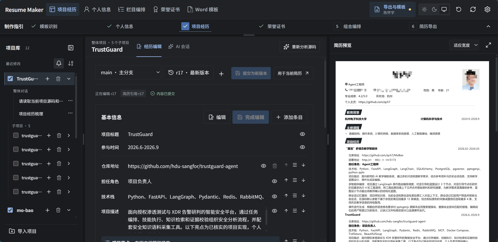

- **从源码整理经历**：关联本机项目目录，让 AI 根据实际代码梳理亮点，再核对引用和个人贡献。
- **为不同岗位保留版本**：经历支持分支、历史对比和恢复，每份简历固定引用选定的版本及亮点。
- **沿用已有模板**：导入可编辑 Word 或带文字层的 PDF，识别填写位置并试填，也可以直接使用内置模板。
- **按投递需要组合内容**：编辑个人资料、挑选荣誉、调整栏目和显隐，保存多份方案及导出记录。
- **观察系统活动**：在“系统日志”查看 API、AI 消息、工具参数及结果和后台任务的时间线，按关键词、类别、级别和时间筛选，展开详情或导出 JSONL，见 [系统日志](docs/system-activity.md)。

## 隐私保护

资料先在本机进行文字提取或 OCR，再由统一隐私网关替换个人信息。保留 Windows 原生 Codex CLI，通过专用只读工具搜索脱敏副本，关闭任意 shell、外部工具和原图输入；无需 WSL、虚拟机或 GPU。结果在本机还原后继续核验引用。

在“工作台设置 → 隐私保护”补充学校、单位等敏感词，检查本地替换效果及最近 10 份脱敏材料包。自动规则和 OCR 可能漏检，工具沙箱属于应用层边界；详见 [隐私保护](docs/privacy.md) 和 [OCR 开销评测](docs/ocr-benchmark.md)。

## 快速开始

### 环境要求

| 依赖 | 用途 |
| --- | --- |
| Python 3.12+、[uv](https://docs.astral.sh/uv/getting-started/installation/) | 安装依赖并运行本机服务 |
| Node.js 22.16+、npm | 构建前端界面 |
| Codex CLI 0.154.0（文件登录或 Responses 供应商配置） | 使用隔离的脱敏材料及专用只读工具分析 |
| Windows + Microsoft Word | 真实排版预览、精确页数和 PDF 导出 |

**完整预览体验推荐 Windows + Microsoft Word；其他平台仍可生成 DOCX。**

### 启动

```powershell
git clone https://github.com/qch7/resume-maker.git
cd resume-maker
.\start.cmd
```

Windows 启动脚本会安装锁定依赖、按需构建界面，并打开 [本机工作台](http://127.0.0.1:8765)。关闭运行终端或执行 `stop.cmd` 可停止本实例。

也可以在 Windows、Linux 或 macOS 的终端运行：

```sh
uv sync --locked
npm --prefix frontend ci
npm --prefix frontend run build
uv run resume-maker
```

### 制作第一份简历

1. **选模板**：使用“内置 · 完整简历”，或在“Word 模板”中导入文件、识别并核对试填结果。
2. **填资料**：在“个人信息”中填写照片、联系方式、教育经历和技能，需要时添加自定义信息。
3. **整理项目**：从左侧项目库导入源码目录，在 AI 会话中整理经历，核对后“提交为新版本”并“用于当前简历”。
4. **选荣誉**：上传证书保存在本机，PDF 和图片先本地提取文字，脱敏后由 CLI 整理字段，核对后加入简历。
5. **排内容**：在“栏目编排”中调整顺序、层级和显隐，对照右侧预览检查版面。
6. **保存导出**：从右上角打开简历库，保存组合并导出 Word，需要时下载同次导出的 PDF 和版本清单。

## 功能预览

### 模板识别

导入可编辑 Word 或有可靠文字层的 PDF 后，AI 根据脱敏文字、布局结构和带节点编号的马赛克图片识别填写位置，再在本机用真实资料试填。图片模板先本地 OCR、遮盖敏感文字并为图像区域打码，再发送脱敏重绘的整页图和坐标，让 AI 恢复版面；原文及照片只在本机放回 Word。扫描 PDF 继续本地 OCR；字体、OCR 和复杂装饰需核对，原图不外发。

下图展示原模板和试填后的效果，黑色栏目标题、分隔线和页首布局沿用原版设计，资料替换为当前简历内容，点击图片可查看原图。

| 原模板 | 识别后的试填预览 |
| --- | --- |
| [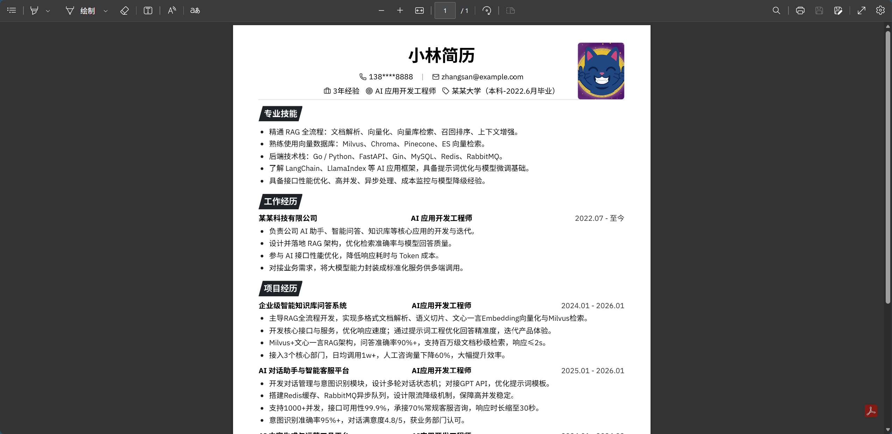](docs/screenshot/原模板.png) | [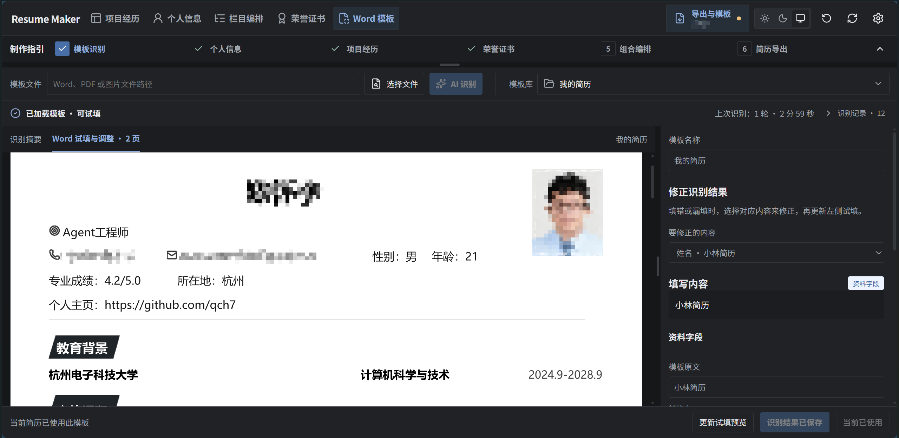](docs/screenshot/模板识别结果.png) |

<details>
<summary>查看模板库：分类、收藏和缩略图</summary>

已保存的模板可以搜索、改名、分类和收藏，支持卡片或列表浏览，也可以从回收站恢复删除的模板。

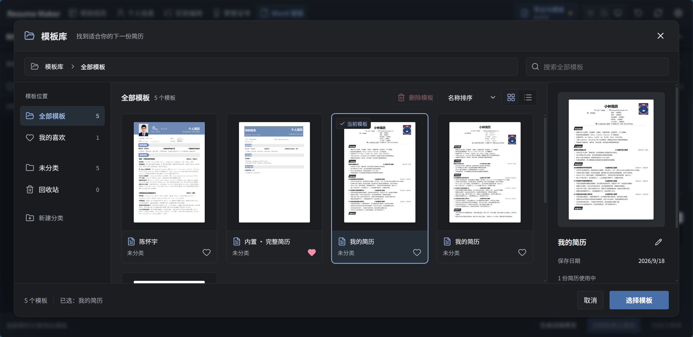

</details>

### 个人资料

照片、联系方式、教育经历和技能集中编辑，基本信息和每条经历均可单独保存；字段旁的眼睛按钮控制当前简历是否显示该项，自定义信息可以补充表单之外的内容。

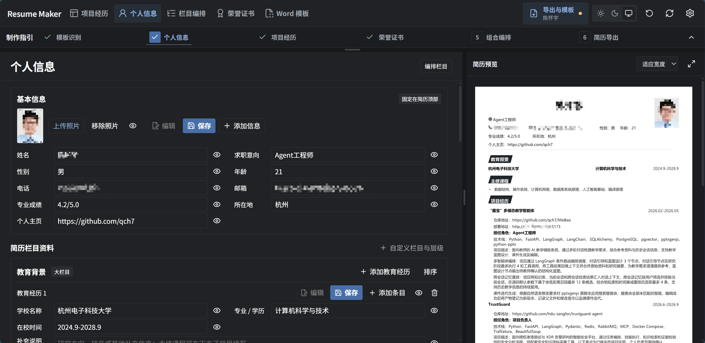

<details>
<summary>查看荣誉资料和专业技能编辑</summary>

荣誉条目可以展开更多信息，专业技能支持多条正文，每条资料都可以单独编辑和调整显隐。

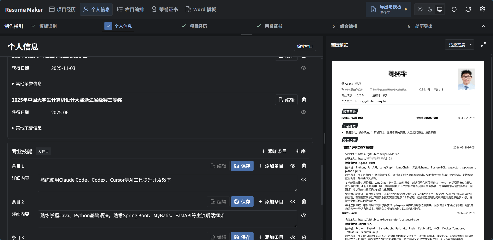

</details>

### 项目经历

一个项目可以关联多个仓库，也可以分别整理子项目；在独立 AI 会话中说明希望突出的部分，讨论整段经历或某条亮点，采用的建议先进入草稿。

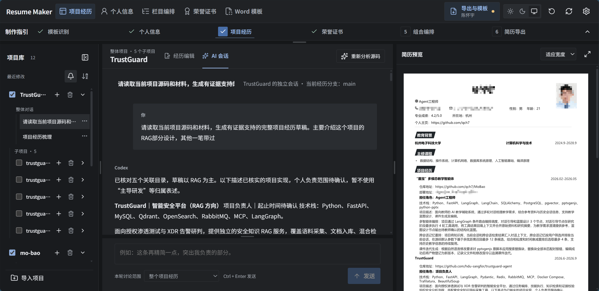

经历支持按岗位创建分支，历史树展示版本关系、修改摘要和未提交的改动；提交新版本后，已有简历继续引用原版本，点击“用于当前简历”才更新当前方案。

<details>
<summary>查看经历历史和分支</summary>

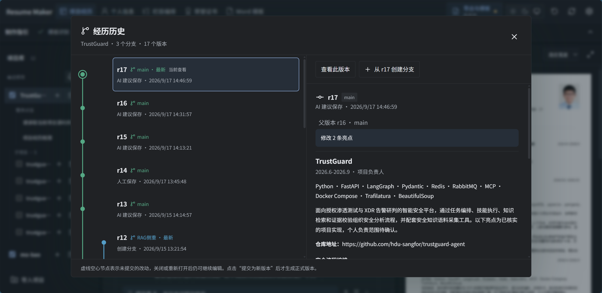

</details>

### 荣誉证书

批量拖入 PDF 或图片后自动提取证书信息，对照原件核对名称、奖项、单位和日期，再按分类、状态或关键词筛选并加入简历；也支持手动录入。

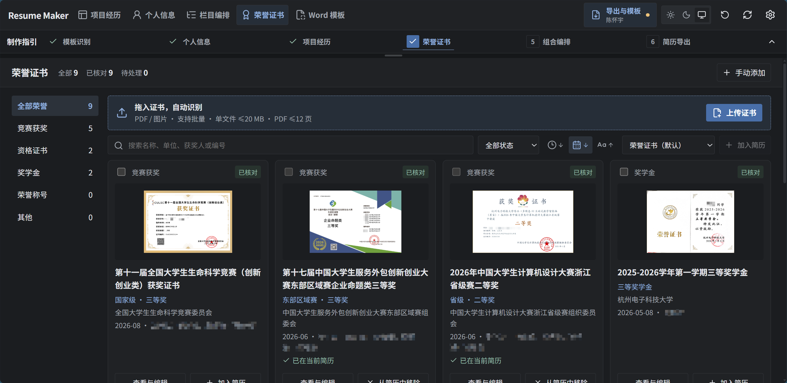

### 栏目编排

通过拖动或上下箭头调整栏目和条目顺序，把课程放进教育背景，或添加实习、自定义栏目；隐藏大栏目时一并隐藏其子栏目，内容仍保留供下次使用。

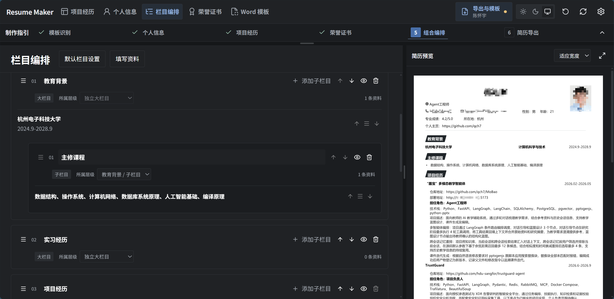

### 简历库和导出

在简历库中保存不同方案，为每份方案选择模板和经历版本；每次导出独立留档，可以查看历史成品并下载 Word、可用的 PDF 和版本清单。

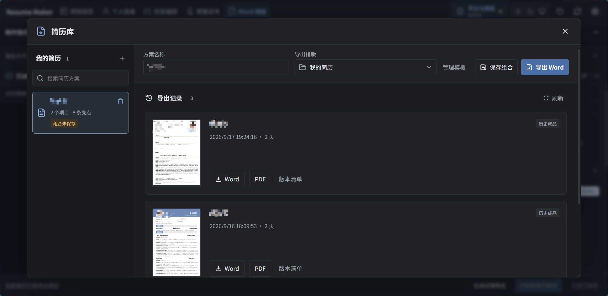

## 运行说明

### 本机数据和备份

服务仅监听本机回环地址，源码运行时的数据保存在 `data/`，包含 `resume.db`、模板、来源快照、导出文件和备份；独立安装包默认使用用户目录下的 `.resume-maker`。

设置中可导出 ZIP 备份，包含资料、经历、会话、模板和荣誉原件；恢复采用离线方式，原项目源码需要另行保存。

可用 `RESUME_MAKER_DATA_DIR` 更改数据目录，也可以通过命令行指定端口和目录：

```sh
uv run resume-maker --port 8768 --data-dir /path/to/resume-data --no-browser
```

### AI 配置

AI 功能使用原生 CLI 0.154.0，复用文件登录和供应商配置；“测试实际连接”会调用所选供应商。CLI 按需列出、搜索和读取关联目录的脱敏源码，分页可以继续，不因项目文件数、总量或单文件大小省略源码；完成后留存引用文件和证据。

AI 请求中的内容会交给所配置的 Provider 处理，个人资料和任务记录仍保存在本机。

### 模板和排版

- DOCX 支持正文、表格、文本框、页眉页脚和内嵌照片，PDF 和图片使用对应的恢复流程生成可编辑模板。
- 识别后需要核对字段和试填结果，复杂结构或无法定位的内容会显示具体问题，可通过人工调整继续修正。
- Word 不可用时仍可下载已生成的 DOCX，页面会显示预览失败的原因，PDF 和精确分页需要本机 Word。

## 文档

| 文档 | 内容 |
| --- | --- |
| [Agent 开发约定](AGENTS.md) | 项目功能、代码规则、注释写法、分支流程和验证要求 |
| [使用指南](docs/user-guide.md) | 编辑、独立会话、模板、主题、布局和数据恢复 |
| [开发指南](docs/development.md) | 环境、检查命令、构建包和常见问题 |
| [架构说明](docs/architecture.md) | 目录职责、依赖方向、数据流和扩展位置 |
| [贡献指南](CONTRIBUTING.md) | 修改规范、中文注释、测试和 PR 要求 |
| [安全说明](SECURITY.md) | 本机访问边界、敏感材料和漏洞报告 |
| [更新记录](CHANGELOG.md) | 面向使用者的版本变化 |

## 开发说明

后端使用 Python、FastAPI 和 SQLite，前端使用 React、TypeScript 和 Vite，文档处理使用 python-docx、PyMuPDF、pdf2docx 和 Word 自动化。

### 项目结构

```text
src/resume_maker/
  api/                 # 应用工厂、请求模型、依赖注入、分组路由
  core/                # 实例配置和业务异常
  domain/              # 数据模型和经历字段规则
  services/            # 经历、项目、会话、队列及导出业务
  infrastructure/      # SQLite、初始结构、实例锁和备份恢复
  integrations/        # 源码证据、Provider、PDF、图片和 Word 适配
  cli.py               # 本机命令行入口
frontend/src/
  app/                 # 跨业务协调和工作台布局
  features/            # 项目、经历、资料、荣誉、简历、模板等功能
  shared/              # 通用控件、hooks、网络、缓存和数据类型
  styles/              # 按功能拆分的样式
tests/                 # 后端业务、HTTP 契约和生命周期回归测试
frontend/tests/        # 纯逻辑和共享草稿注册表测试
scripts/               # 启停、质量检查和构建维护脚本
docs/                  # 使用说明、开发文档和历史记录
  screenshot/          # README 中的界面截图
.github/               # CI 和贡献模板
```

### 验证

```sh
uv run python scripts/check.py
```

该入口检查中文函数说明、模块依赖、格式、类型、测试和生产构建，自动测试使用临时目录和 AI 替身；GitHub Actions 在 Windows 和 Ubuntu 上执行检查，并验证 wheel 内的前端资源和数据库初始结构。

新功能从 `main` 创建独立分支，通过 PR 合并，确认合并后删除功能分支，具体规则见 [AGENTS.md](AGENTS.md)。

本项目采用 [MIT 许可证](LICENSE)。欢迎通过 [Issue](https://github.com/qch7/resume-maker/issues) 反馈问题或按[贡献指南](CONTRIBUTING.md)提交改进。
