<p align="center">
  <picture>
    <source media="(prefers-color-scheme: dark)" srcset="docs/assets/branding/resume-maker-dark.png">
    <source media="(prefers-color-scheme: light)" srcset="docs/assets/branding/resume-maker-light.png">
    
  </picture>
</p>

<p align="center">
  <strong>从项目源码，到可编辑的 Word 简历。</strong>
</p>

<p align="center">
  AI 整理项目经历 · 按岗位管理版本 · 沿用你的简历模板
</p>

<p align="center">
  <a href="https://github.com/qch7/resume-maker/actions/workflows/ci.yml"></a>
  <a href="LICENSE"></a>
</p>

<p align="center">
  <a href="#快速开始">快速开始</a> ·
  <a href="#功能预览">功能预览</a> ·
  <a href="docs/user-guide.md">使用文档</a> ·
  <a href="https://github.com/qch7/resume-maker/issues">反馈问题</a> ·
  <a href=".github/CONTRIBUTING.md">参与贡献</a>
</p>

## 简介

项目处于开发阶段，尚未正式发布。

ResumeMaker 是面向开发者的开源简历工作台，在本机运行。导入项目源码，让 AI 根据代码整理经历；按岗位选择内容和版本，再用自己的模板生成可编辑的 Word 简历。

它适合需要持续积累项目经历、为不同岗位维护多份简历，以及希望沿用已有 Word 模板的求职者。

[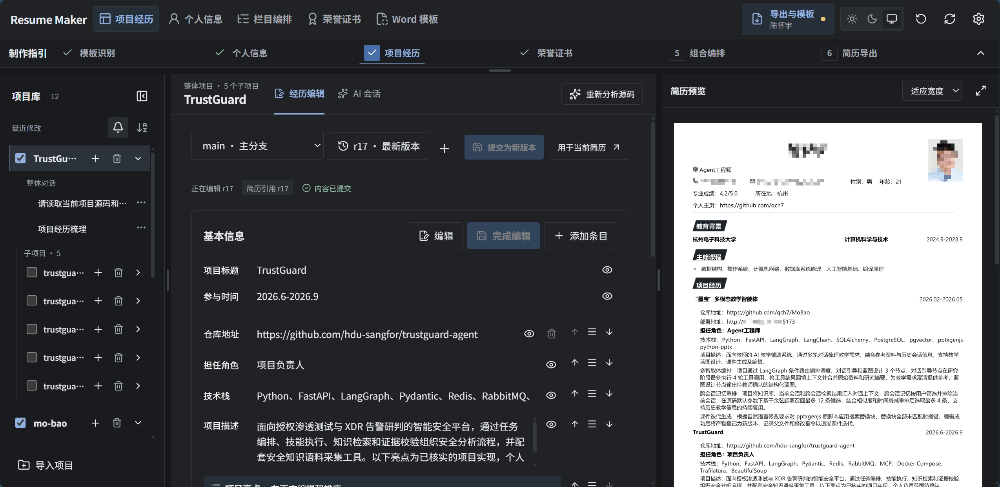](docs/assets/screenshots/项目经历页.png)

## 功能特性

| 核心能力 | 使用方式 |
| --- | --- |
| **源码分析** | 关联多个源码目录或子项目，让 AI 梳理技术亮点，通过文件引用核对事实和个人贡献。 |
| **经历版本** | 按岗位创建分支、查看历史和恢复内容，每份简历固定引用选定的版本及亮点。 |
| **模板适配** | 使用内置模板，或导入 Word、PDF、图片，识别填写位置并用当前资料试填。 |
| **资料和荣誉** | 集中管理照片、教育、技能和自定义信息，批量识别证书，核对后用于多份简历。 |
| **编排和导出** | 调整栏目顺序、层级和显隐，保存多份方案，导出 Word、可用的 PDF 和版本清单。 |
| **本机数据** | 自动保存草稿，支持 ZIP 备份和离线恢复；发送给 AI 的材料先经过本地脱敏。 |
| **招聘收藏夹** | 自建领域、分类和招聘网址；支持 JSON 导入预览和导出。 |

## 按需选择能力

工作台使用插件组合：18 个系统插件和 5 个本地提供方构成最小产品，隐私和 sandbox 始终必需。AI、来源分析、荣誉识别、模板、OCR、Word 和招聘收藏可按依赖选装或停用。

已有数据目录沿用已保存的插件选择。新目录可启动最小组合：

```sh
uv run resume-maker --profile minimal --data-dir ./data-minimal
```

最小组合支持手工经历、不可变版本、个人资料、简历编排、内容预览、DOCX 和备份恢复。Word 的精确分页和 PDF 属于可选能力。在“设置 → 插件”选择极简模式或扩展模式，查看变更计划后应用；停用保留资料和草稿。外部插件支持本地包、HTTPS 下载和版本锁；多个插件可以一起试运行，官方启动器自动完成需要的重启，资料兼容时支持失败回退。

已构建 wheel 的基础安装不需要 OCR、PDF 和图片处理库；需要对应能力时使用 `resume-maker[pdf]`、`resume-maker[images]`、`resume-maker[ocr]`、`resume-maker[word]` 或 `resume-maker[all]`。依赖安装后重启，再启用相关插件。源码开发环境默认包含完整依赖，方便回归。

当前架构和扩展方式见 [架构说明](docs/architecture.md) 和 [插件开发](docs/reference/plugin-sdk.md)。

41 个内置插件均以独立目录存放在 `src/resume_maker/plugin_packages/`，各包拥有清单、入口、业务代码、资料声明及客户端。宿主扫描目录发现插件，按能力依赖装配；前端按包独立构建并通过公开 SDK 注册界面。停机后移除可选代码目录并重新构建，缺失能力及依赖它的扩展会不可用，手工资料、历史和基础 DOCX 流程仍可用。移除代码不会删除已存资料。物理缺包验收见开发指南。

## 快速开始

### 1. 安装并启动

推荐使用 **Windows + Microsoft Word**，以获得完整的排版预览和 PDF 导出能力。Linux 和 macOS 可运行工作台并生成 DOCX。

从源码运行需要 [Git](https://git-scm.com/downloads)，以及以下工具：

| 工具 | 用途 | 何时需要 |
| --- | --- | --- |
| Python 3.12+、[uv](https://docs.astral.sh/uv/getting-started/installation/) | 安装锁定依赖，运行本机服务 | 必需 |
| [Node.js](https://nodejs.org/) 22.16+、npm | 安装前端依赖，构建界面 | 必需 |
| [Codex CLI](https://github.com/openai/codex) | 使用已配置的模型分析项目、识别模板和证书 | 使用 AI 功能时 |
| Microsoft Word（Windows） | 真实排版预览、精确页数和 PDF 导出 | 使用完整预览和 PDF 导出时 |

**Windows：**

```powershell
git clone https://github.com/qch7/resume-maker.git
cd resume-maker
.\start.cmd
```

启动脚本会安装 Python 依赖、按需安装前端依赖并构建界面，然后打开 [本机工作台](http://127.0.0.1:8765)。关闭运行终端或执行 `.\stop.cmd` 可停止实例。

<details>
<summary>手动启动（Windows / Linux / macOS）</summary>

```sh
git clone https://github.com/qch7/resume-maker.git
cd resume-maker
uv sync --locked
npm --prefix frontend ci
npm --prefix frontend run build
uv run resume-maker
```

默认地址为 <http://127.0.0.1:8765>。更多启动参数见[开发指南](docs/development.md)。

</details>

### 2. 连接 AI（可选）

如需使用 AI 功能，先在本机完成 Codex CLI 的文件登录或 Responses 供应商配置，再打开“工作台设置 → 模型连接”：

1. 确认“Codex 可执行文件”路径，按需填写模型、思考强度和 CLI Profile；模型和 Profile 留空时沿用 CLI 配置。
2. 点击“测试实际连接”。该操作会保存设置，并向所选供应商发起一次真实请求。
3. 在“隐私保护”中补充学校、单位等敏感词，使用本地检测和脱敏材料预览核对效果。

暂不使用 AI 时，可以先用内置模板填写资料、编排和导出简历。各项功能的模型配置见[使用指南](docs/user-guide.md)。

### 3. 制作第一份简历

1. **选模板**：选择“内置 · 完整简历”，或导入自己的模板并核对识别、试填结果。
2. **填资料**：填写联系方式、照片、教育和技能，按需增加自定义信息。
3. **整理项目**：导入源码目录，在 AI 会话中整理经历，核对后“提交为新版本”并“用于当前简历”。
4. **选荣誉**：上传证书并核对识别结果，或手动录入，再选择加入当前简历。
5. **排内容**：调整栏目和条目的顺序、层级、显隐，对照预览检查版面。
6. **保存导出**：打开简历库，保存方案并导出 Word；具备 Word 环境时，可下载同次导出的 PDF。

## 功能预览

### 源码分析和经历版本

在 AI 会话中讨论整段经历或某条亮点，建议经你采用后进入草稿。经历更新后，已有简历继续引用原版本，点击“用于当前简历”才更新当前方案。

<details>
<summary>查看 AI 会话和经历版本管理</summary>

**结合源码讨论项目经历**

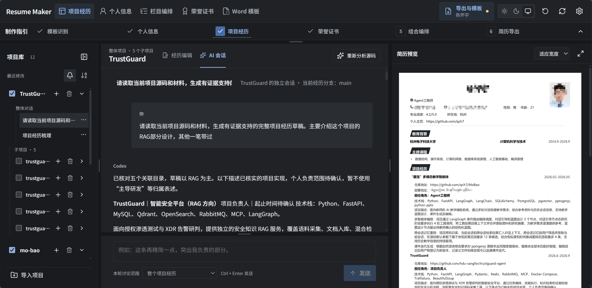

**查看分支、修订和历史内容**

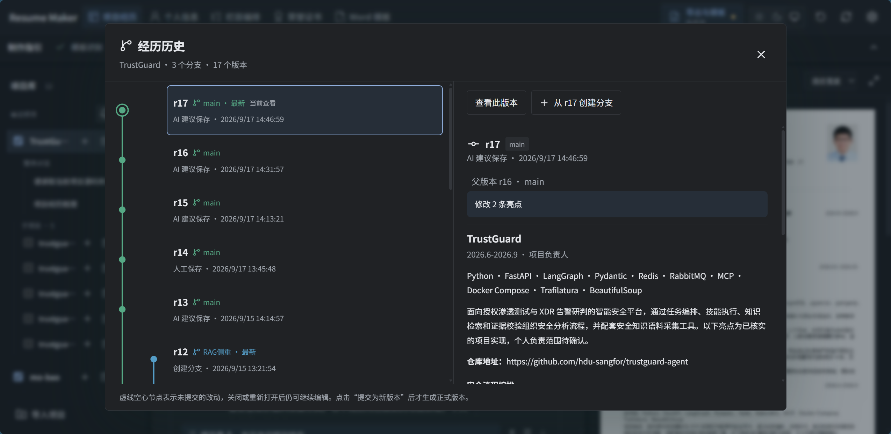

</details>

### 模板识别和试填

可编辑 Word 模板沿用原有结构，PDF 和图片通过恢复流程生成可编辑模板。下图展示原模板和试填结果；字体、照片位置、OCR 结果和复杂装饰需要人工核对。

| 原模板 | 识别后的试填预览 |
| --- | --- |
| [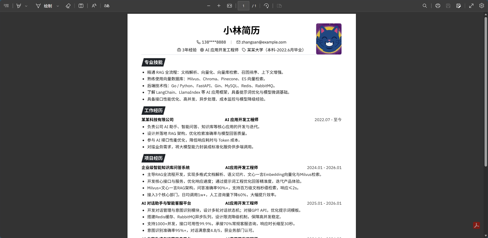](docs/assets/screenshots/原模板.png) | [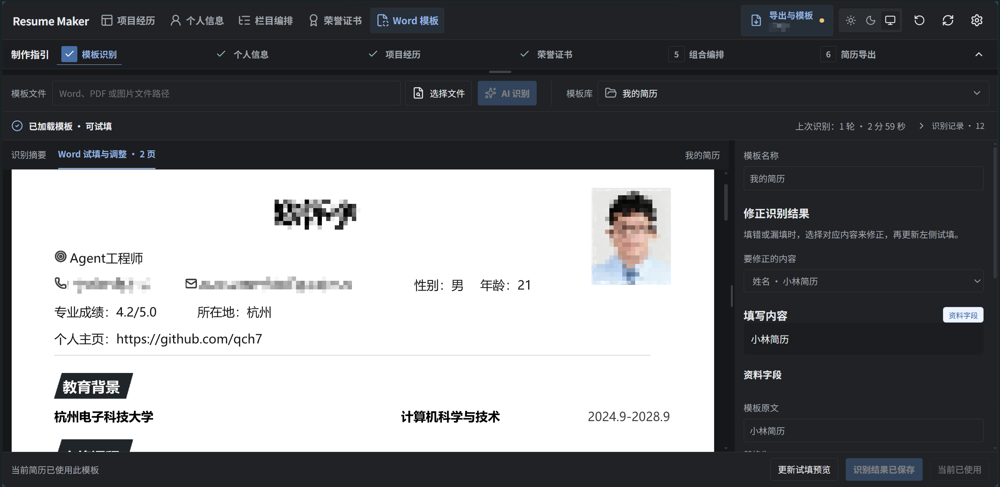](docs/assets/screenshots/模板识别结果.png) |

<details>
<summary>查看模板库：分类、收藏和缩略图</summary>

已保存的模板支持搜索、改名、分类、收藏和回收站恢复，可按卡片或列表浏览。

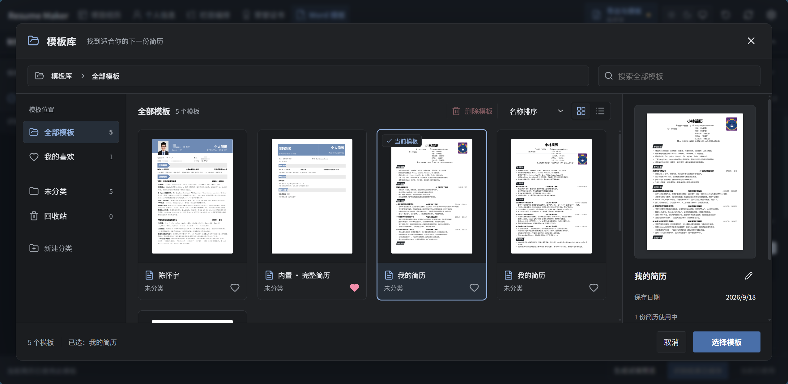

</details>

### 个人资料、荣誉和栏目编排

资料和荣誉统一管理，栏目支持拖动排序、两级编排和独立显隐。隐藏内容仍保留，便于下一份简历重新使用。

<details>
<summary>查看个人资料、荣誉证书和栏目编排</summary>

**个人信息和教育经历**

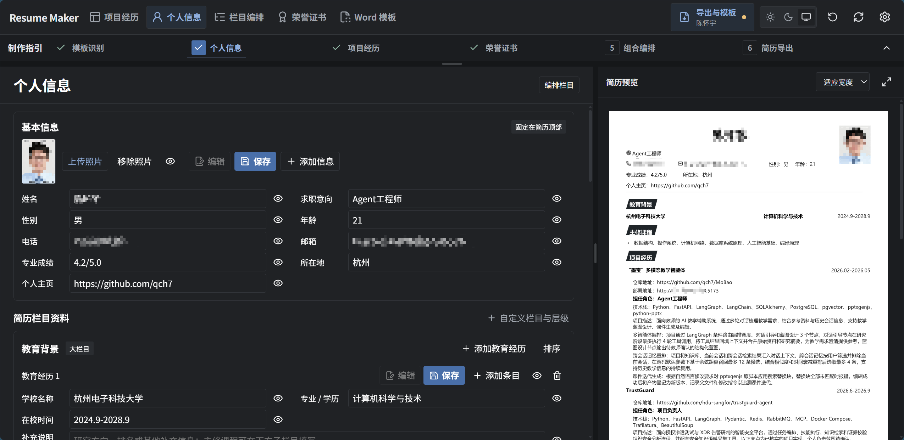

**荣誉资料和专业技能**

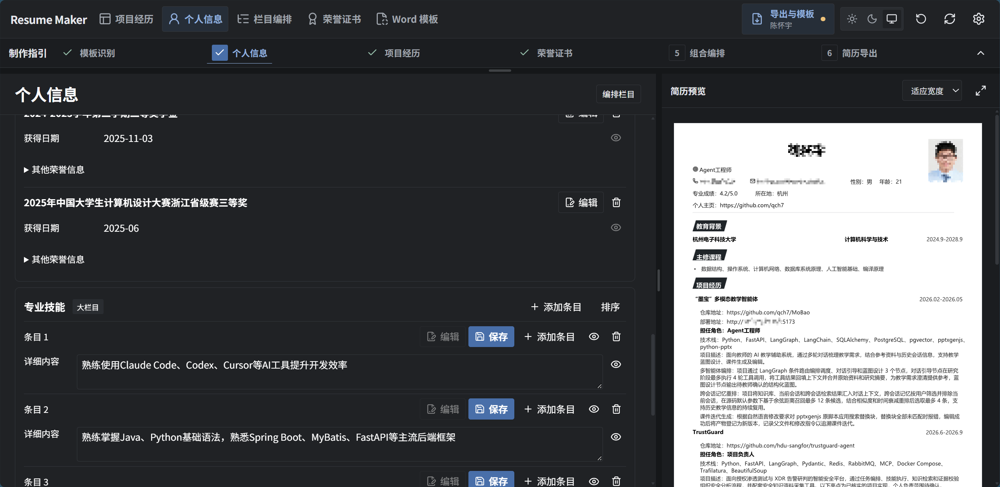

**证书识别和人工核对**

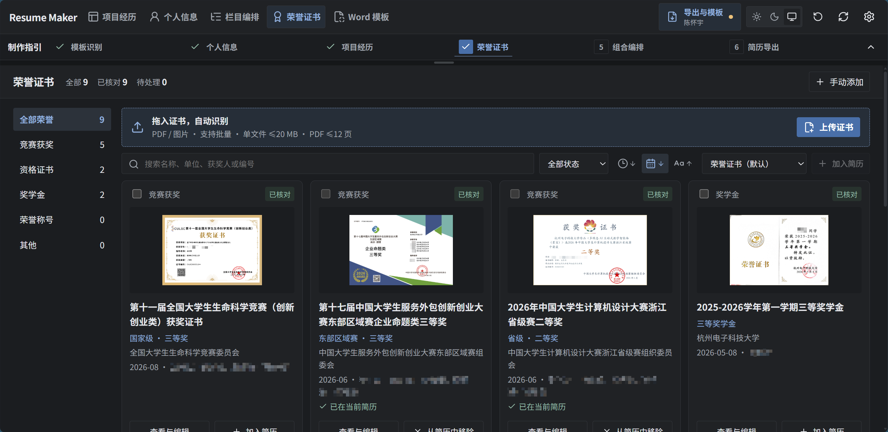

**栏目顺序、层级和显隐**

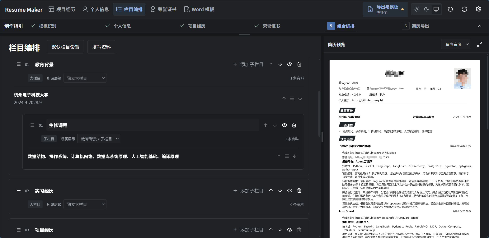

</details>

### 简历方案和历史成品

为不同岗位保存模板、经历版本和亮点的组合。每次导出独立留档，可重新下载历史成品及其版本清单。

<details>
<summary>查看简历方案和历史导出记录</summary>

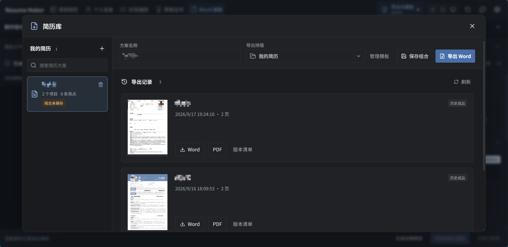

</details>

## 数据和隐私

**本机保存。** 应用面向单用户，仅监听 `127.0.0.1`。源码运行的数据保存在项目下的 `data/`，独立安装包默认使用用户目录下的 `.resume-maker/`。编辑会自动保存为草稿，正式版本仍需保存或提交。

**AI 请求先脱敏。** 文本在本机提取并替换敏感信息；图片和扫描页经过本地 OCR、身份遮盖和图像打码，模板原图及照片不外发。处理后的材料会交给配置的模型供应商，结果在本机还原。自动规则和 OCR 可能漏检，请补充敏感词并核对发送记录。详见[隐私保护](docs/reference/privacy.md)和[安全说明](.github/SECURITY.md)。

**备份和恢复。** 在设置中导出 ZIP，包含资料、草稿、经历、会话、模板和荣誉原件，停止服务后可离线恢复。原项目源码和系统日志不在备份中；换机时需另行迁移源码并重新关联目录。详见[数据持久化](docs/reference/persistence.md)。

<details>
<summary>自定义端口和数据目录</summary>

在仓库根目录运行：

```sh
uv run resume-maker --port 8768 --data-dir ./my-resume-data --no-browser
```

也可以复制 [`.env.example`](.env.example) 为源码根目录 `.env`，配置端口、资料目录及浏览器开关等六个启动字段。优先级为命令行 > 进程环境 > 配置文件 > 默认值。独立安装包用 `--env-file` 指定文件；`--print-config` 可查看有效值及来源。Windows 启停脚本支持同样的配置文件和覆盖规则，详见[启动配置](docs/reference/configuration.md)。

</details>

## 常见问题

<details>
<summary>没有 Microsoft Word 可以使用吗？</summary>

可以管理资料、编辑经历并生成 DOCX。真实排版预览、模板缩略图、精确分页和 PDF 导出依赖 Windows 上的 Microsoft Word。Word 不可用时，页面会说明预览失败的原因，已生成的 DOCX 仍可下载。

</details>

<details>
<summary>AI 连接失败时，先检查什么？</summary>

先确认本机 Codex CLI 的路径、登录或供应商配置，再点击“测试实际连接”。项目按 CLI 的配置和工具能力检查兼容性，不限定固定版本号；失败时显示具体错误。关联请求和任务详情可在“系统日志”查看，见[系统日志说明](docs/reference/system-activity.md)。

</details>

<details>
<summary>启动后提示前端尚未构建怎么办？</summary>

Windows 下可运行 `.\start.cmd -Rebuild`。也可以在仓库根目录执行以下命令，完成后重新启动服务：

```sh
npm --prefix frontend ci
npm --prefix frontend run build
```

更多排查方法见[开发指南](docs/development.md)。

</details>

## 文档

完整索引见 [文档目录](docs/README.md)。

| 文档 | 内容 |
| --- | --- |
| [使用指南](docs/user-guide.md) | 完整操作流程、AI 设置和模板适配 |
| [隐私保护](docs/reference/privacy.md) | 脱敏机制、发送范围和能力边界 |
| [数据持久化](docs/reference/persistence.md) | 草稿、备份和离线恢复 |
| [系统日志](docs/reference/system-activity.md) | API、AI 和后台任务的记录及排查 |
| [开发指南](docs/development.md) | 开发环境、检查、打包和常见问题 |
| [架构说明](docs/architecture.md) | 模块职责、依赖和数据流 |

## 开发和贡献

后端使用 **Python / FastAPI / SQLite**，前端使用 **React / TypeScript / Vite**，文档处理使用 python-docx、PyMuPDF、pdf2docx 和 Word 自动化。

```text
src/resume_maker/   # 后端 API、业务逻辑、存储和外部集成
frontend/src/      # 工作台界面、功能模块和共享组件
tests/             # 后端回归测试
frontend/tests/    # 前端逻辑测试
scripts/           # 启停、检查、构建和模板评测
docs/              # 当前使用指南、架构、协议和展示资源
data/              # 本机正式资料，不进入 Git
.local/            # 沙箱、缓存、锁和构建产物，不进入 Git
```

完成快速开始中的依赖安装后，在仓库根目录运行完整检查：

```sh
uv run python scripts/check.py
```

该命令覆盖代码规范、模块依赖、后端测试、前端类型和格式检查、前端测试及生产构建。CI 在 Windows 和 Ubuntu 上执行检查，并额外验证 wheel 中的资源。

欢迎通过 [Issue](https://github.com/qch7/resume-maker/issues) 反馈问题，也欢迎提交代码、文档改进或可复现的模板适配案例。开始前请阅读[贡献指南](.github/CONTRIBUTING.md)和 [Agent 开发约定](AGENTS.md)。

问题报告请附上运行环境、复现步骤和脱敏截图；安全问题按[安全说明](.github/SECURITY.md)中的流程提交。

## 许可证

本项目采用 [MIT 许可证](LICENSE)。
