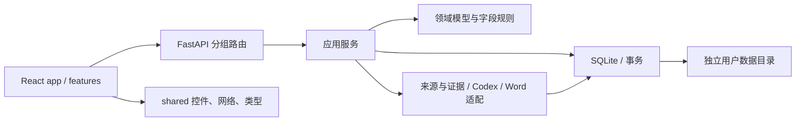

# 架构说明

## 设计边界

项目由一个 Python 本机服务和一个 React 客户端组成。FastAPI 同源提供 API 与前端构建资源，SQLite 保存用户数据；源码仓库不保存个人简历、模板、聊天记录或分析快照。领域规则保留为直接函数，业务服务直接使用短连接数据库，不额外引入 ORM 或通用仓储框架。

## 后端职责

| 位置 | 职责与修改入口 |
| --- | --- |
| `api/app.py` | 创建每个实例的服务容器，统一管理后台任务生命周期 |
| `api/dependencies.py` | 从当前请求的应用读取服务，避免模块全局变量共享用户目录 |
| `api/routes/` | 按 projects、conversations、jobs、resumes、templates、settings、system 拆分 HTTP 入口 |
| `api/schemas.py` | 请求体约束；HTTP 特有字段留在接口层 |
| `api/middleware.py` | Host、Origin、令牌检查和统一错误响应 |
| `api/static.py` | 同源静态资源与首页令牌注入 |
| `core/` | 配置及可展示的业务异常，不依赖业务服务 |
| `domain/models.py` | 经历、证据、组合、AI 输出等数据契约 |
| `domain/experience.py` | 字段读取、替换、排序校验等无副作用规则 |
| `services/catalog.py` | 不可变版本、逐字段草稿、采用冲突和固定组合的事务边界 |
| `services/projects.py` / `conversations.py` / `workspace.py` | 项目维护、会话维护及工作台聚合查询 |
| `services/jobs.py` | 持久队列、真实来源上下文、建议校验、取消和结果发布 |
| `services/documents.py` | 模板登记、固定版本导出与追溯清单编排 |
| `services/templates.py` | 独立模板分析任务、映射核对、试填和保存 |
| `services/template_library.py` | 模板分类和收藏事务、按源文件哈希缓存的真实首页缩略图 |
| `domain/templates.py` | 字段引文、重复范围、照片和原文处置的声明式映射 |
| `infrastructure/database.py` | SQLite 短连接、即时写事务和 JSON 列编解码 |
| `infrastructure/schema.sql` | 当前完整数据库结构，空库一次性创建全部表和索引 |
| `infrastructure/storage.py` | 跨进程实例锁、在线备份、离线验证和目录切换 |
| `integrations/sources.py` | 本机源码目录定位、引用文件留存和原文证据匹配 |
| `integrations/providers/base.py` / `codex.py` | 可注入的 Provider 协议与 Codex CLI 实现 |
| `integrations/word/` | OOXML 区域操作、渲染编排和独立 Word COM 进程 |

依赖约束由 `scripts/check_quality.py` 检查：`core` 不反向依赖任何业务模块；`domain` 不依赖数据库、适配器、服务或 HTTP；`infrastructure` 与 `integrations` 不依赖服务和 HTTP；`services` 不依赖 HTTP。业务错误通过 `core.errors.Problem` 传递，接口层负责转换成响应。

## 前端职责

模板选择共用 `shared/components/TemplatePicker.tsx` 与 `template-library/` 下的原生模态浏览器，通过 portal 进入顶层，避免父工作区裁切。分类及 Like 由 `/api/template-library` 写入现有 `settings` 表中的独立配置，单字段事务合并避免并发覆盖，不修改不可变模板映射或简历引用。缩略图使用独立源文件副本并按内容缓存到 `templates/.previews/`；卡片仅在进入可见范围时请求，失败显示原因并允许重试。

`app/App.tsx` 负责跨业务导航、刷新和消息提示；布局状态交给 `app/useWorkspaceLayout.ts`。每个 `features/` 子目录维护本功能的组件及状态逻辑：

- `projects`：侧栏、会话入口及稳定排序。
- `experiences`：整段编辑、单条亮点编辑与字段草稿 hook。
- `conversations`：消息输入、建议对比卡和任务事件流。
- `resumes`：固定版本组合 hook、内容预览与真实分页图片。
- `settings`：来源、模板与 Provider 设置。
- `templates`：AI 模板分析、字段和重复区域编辑、原图核对及真实试填。
- `workflow`：制作指引状态推导和步骤定位。

`shared/` 只包含可复用控件、尺寸/请求 hooks、网络和本机缓存工具，以及与 API 对齐的数据类型。经历与会话共同使用 `shared/lib/draftRegistry.ts`：导航、保存和导出前先等待注册的草稿写入，失败时保留编辑现场。共享层不能导入 `features` 或 `app`，业务模块不能导入 `app`；前端质量脚本自动检查这些边界。

样式按 `base → workspace → components → history → responsive` 顺序导入。拆分保持原有选择器顺序和优先级，避免移动文件时改变布局表现。

## 关键数据约束

1. **经历修订不可变**：发布或恢复创建新修订，`parent_id` 表示真实父版本；分支通过 `experience_branches.head_revision` 指向各自最新版本，项目响应中的 `head_revision` 从主分支查询，不在项目表重复存储，不改旧版本正文。
2. **草稿带版本号**：按项目、基础修订和字段定位。保存或删除时检查版本，防止两个窗口静默覆盖。
3. **修改与提交分离**：编辑、增删和排序只写草稿；界面仅通过“提交为新版本”发布整个工作副本。内容未改变时确认草稿，不生成重复修订。前后端统一提交整个工作副本，提交接口仅接收基础修订与预期分支头；逐字段编辑仍写入独立草稿。
4. **简历固定引用**：`ResumeItem` 保存具体 `revision_id` 与 `highlight_ids`；经历更新必须由用户显式用于当前简历。
5. **AI 输出先成为建议**：生成建议记录修改前后内容和来源快照；采用时再次校验原文及事务内状态，采用后仍须人工保存。
6. **任务串行执行、会话相互隔离**：任务以请求标识幂等提交；同一会话只允许一个活动任务。取消后不得发布迟到结果。
7. **来源可追溯**：AI 直接读取当前关联源码；结果返回后仅留存引用文件，记录文本、原文件及存储哈希、来源状态和读取问题，之后的源码修改不改变已有证据。
8. **Word 按确认的映射替换**：完整模板按精确引文替换资料、复制条目样式和更换照片。校验节点、重叠范围、未处理原文以及当前资料覆盖，保留样式与页面设置，清除未使用的旧照片资源。渲染在独立进程执行，按 PID 和创建时间核验后回收。
9. **整体与子项目相互独立**：多来源整体项目通过 `project_hierarchy` 关联单来源子项目；经历、草稿、快照、会话和简历引用仍按各自项目标识隔离。导入和来源更新在事务中同步子项目，启动时不再补建数据。来源移除时解除分组并保留旧子项目历史。

经历历史由 `services/history.py` 管理，`revision_branches` 记录修订所属分支。创建分支时追加一个内容相同的起点修订，并可复制来源草稿到新修订的草稿空间；因此两个分支从同一版本出发也不会共享未发布修改。保存、恢复及 AI 建议采用均校验目标分支头，分支指针和修订、草稿清理在一个 SQLite 写事务中完成。历史树按真实父子关系绘制，不按时间猜测；查看旧节点后必须创建分支或追加恢复才能继续发布。项目创建时在同一事务内建立 `main` 与初始修订。经历数据不双写 Git，避免数据库与仓库出现部分提交。

项目详情的 `uncommitted` 列出各基线版本与有效工作副本的实际差异。历史树用 `working:<base_revision>` 临时节点显示这些内容，虚线连接到基线；该标识仅用于展示，不写入 revisions，也不能成为简历引用或分支起点。打开历史窗口前先刷新字段草稿，排序同样使用 `useField` 的本机恢复副本、串行写入和并发版本检查。

## 扩展方式

荣誉证书由 `services/honors.py` 独立管理，每个条目以 `honor:<uuid>` 保存到现有 `settings` 表，事务内校验版本，不改变数据库结构。原件与解码后的 PNG 分页放在 `honors/<uuid>/`，纳入备份目录。二进制上传在 HTTP 层限制 20 MB；适配器按实际文件内容校验格式，PDF 限 12 页，单图限 4000 万像素。实例启动时运行单个识别队列，复用 Provider 的结构化图片输入及 `honor_recognition` 功能设置，取消、删除和退出后拒绝迟到结果；异常退出的在途条目在下次启动时转为可重试状态。识别结果先进入待核对资料，重识别保留已人工确认的字段，由用户选择是否采用新提取结果。

前端 `features/honors` 提供独立的全宽荣誉库、批量上传、分类搜索和原件核对表单。加入简历时生成带 `honor:<uuid>` 标识的普通条目并跨栏目去重，不自动保存或修改既有方案。库条目与简历中的文字是独立副本，因此库的编辑和删除不会改变已制作简历。

模板统一使用 `templates.mapping_json` 保存 `{"plan": TemplatePlan}`，工作台只列出具有完整映射的模板，不再传递模板类型。`Catalog.template` 统一校验组合、编辑、预览和导出的模板引用；不转换或删除缺少完整映射的记录，也不提供手动段落区间导入接口。`template_map.py` 给正文、表格、页眉页脚、文本框与图片分配快照内稳定节点，`template_fill.py` 校验后执行替换。模型仅输出声明式映射，模板文字按数据处理。

模板分析复用项目队列的 Provider 实例和设置，使用独立工作区、结果 schema 与取消信号，不占用项目会话。分析任务保存在当前应用实例内存，应用退出时取消并回收；已确认模板另存常规模板目录并进入备份。试填与导出共用填充器，预览使用独立目录，HTTP 路由验证任务归属、文件类型及实例令牌。

`template_fields.py` 在分配节点编号前按正文、文本框和独立脚注匹配跨文字片段的域边界，冻结除页码以外的域并保留已有显示结果与样式；无显示结果的位置成为可编辑空位，不完整的控制标记自动清理。归一化副本再次读取时编号稳定；不执行域、不访问链接。页码允许格式开关。前端新文件导入错误独立保存文件名与原因，不能冒充下方已有模板的校验结果。

- 新增业务接口：在 `api/schemas.py` 定义请求；把规则或事务放入 `domain/` 或 `services/`，再接入相应路由。不要把后台线程放到导入时启动。
- 新增 AI Provider：实现 `integrations/providers/base.py` 的协议，通过 `create_app(provider=...)` 注入。`run` 返回经历建议 `AIResult`，`run_structured` 按指定领域模型生成严格结构化结果；适配器不能直接发布修订或登记模板。
- 新增模板或渲染方式：扩展 `integrations/word/`，保持 DOCX 包保留约束；由 `services/documents.py` 记录结果清单。
- 修改数据库：项目尚未上线，直接维护完整 `schema.sql`，不维护历史升级链。结构变化时更新 `SCHEMA_VERSION`，建库、备份恢复和安装包检查共用该版本；使用新的测试数据目录，不自动转换或清空旧库。
- 修改跨功能 UI：状态协调留在 `app/`，通用机制抽到 `shared/`，先验证草稿刷写、快速切换与异步响应的归属。

`tests/fixtures/api-contract.json` 记录当前接口定义；测试忽略说明文字，核验路径、参数、请求模型及响应格式。修改通信协议时同步更新前端与该契约，不保留旧客户端适配。`resume_maker.api.create_app` 和 CLI 是应用入口。

右侧只保留一个真实简历预览，项目排序与编辑嵌入“栏目编排”的项目经历栏目，预览成功后不显示排版状态卡片，历史导出仅保留文件下载。内置版式与导入模板都使用正式导出共用的生成器。`POST /api/resume-previews` 接收当前个人资料、栏目和可选经历工作副本，验证固定修订归属后调用正式导出共用的完整模板填充器或内置生成器，不发布经历、不保存组合、不登记导出。临时文件和成功结果缓存仅属于当前应用实例，退出时回收；下载接口校验实例令牌和文件白名单。前端停顿一秒后提交，最多一个请求在途，完成后只渲染最新输入；输入变化不取消在途 HTTP 请求，避免 Word 后台积压。过时响应不更新页面，同模板旧图片显示更新提示，切换模板不展示旧模板图片。排版失败保留可下载的试填 Word，允许重试。填充前由 `template_layout.py` 根据栏目标题和重复区标记整组范围，填充后按当前大栏目及子栏目顺序重排，标题、记录和样式一起移动；空栏目与隐藏栏目不保留孤立标题，含 GPA 等已填写个人字段的区域仍保留。浮动栏目标题保留原图形和横坐标，转为嵌入式时抵扣原先为图形预留的段前空白。分栏条目复制原节属性；删除旧记录时保留有效分节并合并已清空的末尾节，避免横排变竖排或产生空白页。识别阶段通过实际试填检测栏目边界，将问题交回模型修正；可编辑 DOCX 不因映射失败重建为普通段落。Word PDF 同时生成文字转轮廓的 SVG 分页与兼容 PNG；模板试填与简历预览均加载 SVG，缩放与放大查看不会降低文字清晰度，也不依赖浏览器字体。

个人资料和栏目条目由前端工厂生成完整字段，显隐与自定义信息数组始终存在；后端拒绝已停用的 `deleted_fields`。方案保存完整替换资料，`document=null` 表示无完整资料的项目组合；导出按 `template_id` 选择完整模板，否则采用内置完整简历。浏览器简历草稿使用 `rm.resume.v2.*` 键，直接保存当前结构，不读取或转换旧缓存。

前端“Word 模板”是紧随“栏目编排”的独立功能区。`TemplateAdapter` 持续挂载以保留切换功能区时的人工编辑；`TemplateTrial` 展示 Word 真实分页，`TemplateAdjustments` 在同一视图右侧按资料和栏目提供修正入口。高级选项内的 `TemplateCanvas` 依据节点祖先关系呈现结构和字段高亮，默认隐藏未使用空段；`TemplateInspector` 编辑当前选区，`AdvancedMapping` 提供完整映射和精确边界。范围选择仅接受相同 Word 部件和直接父节点的同级块；所有人工修改会使校验和试填失效；旧分页保留供对照并标明待更新，更新试填后才允许保存和下载。结构选择仅作为高级工具，真实分页在主区域持续展示。

`TemplateOptions` 统一导出排版与模板库的选项，始终包含“内置 · 完整简历”。内置版式继续以 `template_id=null` 表示，不创建模板数据库记录或调用 AI 识别；模板页复用 `TemplatePreview` 和当前经历工作副本显示真实分页，选用后更新当前简历草稿。切换到内置版式会撤销旧映射读取，防止迟到结果覆盖当前预览。

`POST /api/templates/{template_id}/edit` 对已保存完整模板做哈希核验后创建当前实例的独立编辑快照，不调用模型。保存仍生成新的模板 ID，不修改旧模板或已有简历引用。分析、编辑副本和试填都沿用实例鉴权与受控文件路径。

本机路径输入统一使用共享 `PathInput` 组件，调用受实例令牌和来源校验保护的 `POST /api/paths/pick`。`integrations/path_picker.py` 在 HTTP 工作线程初始化 STA 并调用 Windows `IFileOpenDialog`，文件和文件夹都返回文件系统完整路径；取消返回空值。跨请求互斥避免重复窗口，COM 对象与文件名内存在原线程释放，输入路径只决定初始浏览目录，不参与命令执行。多来源输入追加并去重，组件卸载或资料切换时丢弃迟到结果。

模板分析把 `skills/resume-template-mapping/SKILL.md` 内容直接注入首轮请求，不要求模型额外读文件；这是运行时使用的唯一映射说明来源。节点清单按部件分组，段落原文与真实父节点、祖先、可插入状态完整保留，表格容器不再重复汇总正文。自动修正只续用本任务 `thread.started` 返回的会话，省去清单和图片；无会话标识时携带完整上下文。人工修正新建任务、首轮携带人工方案。

`template-cache/` 是可重建的建议缓存，不是已应用模板。缓存键包括规范化包内容、资料字段需求、schema、skill 和执行契约版本；资料值不入键。只有通过结构及当前资料覆盖检查的自动分析结果入缓存，命中后再校验，反馈修正绕过缓存；损坏或不可用缓存不阻塞分析。修改清单编号或填充语义时同时调整缓存契约版本。缓存无需数据库迁移，也不代替已确认模板备份。

`GET /api/templates/analyses/{id}/progress?after=N` 仅返回状态、耗时、累计用量和增量公开活动，服务端最多保留 80 条活动。界面首次及完成时各加载一次完整任务，运行中每 800 ms 顺序请求轻量进度，连接失败时重试。Codex `exec --json` 的会话、回合、工具状态和公开文字会转为摘要；推理原文、命令参数、最终映射不进入活动记录。用量只来自 CLI 完成事件，不模拟 token 流或完成百分比。取消后阻止迟到事件并冻结单调时钟耗时。

Codex 接口依据 [OpenAI 官方非交互模式说明](https://learn.chatgpt.com/docs/non-interactive-mode)，并在本机验证结构化输出与 `exec resume` 组合。

`ProviderSettings` 保存全局模型、思考强度及各类 AI 功能覆盖；功能模型与强度分别继承全局值，全局留空则由 CLI / Profile 决定。经历与证书任务在入队时、模板任务在启动时通过 `for_function()` 固化有效配置，后续修改不影响在途任务；普通对话与指定亮点对话按提交范围区分。模板识别与人工完善分别选择功能配置，每一轮自动修正沿用本次任务的模型和强度。连接测试也有独立覆盖。新会话和续聊都用 CLI 参数传入选择，不写回用户的 Codex 配置文件。

模板缓存键包含已解析的模型、思考强度、CLI Profile 与程序路径，设置变化后重新识别。支持的强度为 `minimal`、`low`、`medium`、`high`、`xhigh`；具体支持范围由所选模型决定。参数依据 [OpenAI 配置参考](https://developers.openai.com/codex/config-reference/)。

模板导入在异步任务中处理已复制的原文件快照。`template_prepare.py` 接受修订、解除绑定与锁定、清理失效注释引用；`template_fields.py` 保留页码并冻结其他动态域的显示结果。`template_recovery.py` 优先保留原生 DOCX 结构，旧格式使用独立 Word 进程自动修复转换；可编辑 DOCX 保留 OOXML 资源和原生图形，尚不支持的对象报告具体问题；扫描件和 PDF 才逐页通过声明式 `RecoveredPage` 恢复可编辑段落与独立照片，再重新分配节点供 `TemplatePlan` 映射。页面恢复有一次自动重试，取消后不发布迟到内容；不可读的原文件明确失败，空白内容使用字段占位框架。恢复时只发送源页面和源文，不发送当前用户资料值。原生解析仍保留包资源上限，鉴权、项目引用、资料覆盖及映射完整性校验不变。识别每轮结构和资料覆盖通过后先执行本机 DOCX 试填，栏目容器或分页冲突参与下一轮映射修正；正式预览和导出共用通过检查的原生模板。`template_anchors.py` 为借用正文段落的独立浮动绘图分出极小高度锚点，保留原坐标和组合关系；组合中的照片仅更换或删除其叶子图片，图形编号在外层绘图和组合子图形之间保持唯一，防止 Word 打开失败。

项目 AI 请求携带 `source_access=direct-read-only` 和 `source_directories`（本轮来源 ID 与真实绝对路径），不再携带快照目录或提前扫描/复制源码。每轮从当前项目读取来源映射；持续会话明确以最新路径及实际搜索为准。`capture_evidence()` 在模型返回后只复制引用文件，校验来源归属、目录边界、链接与敏感文件，现有 `snapshots` 表继续保存证据，未产生引用的任务不建立记录。旧快照和证据仍支持追溯与来源定位，无数据库迁移。Provider 保持只读沙箱，会话工作目录只用于 schema 等内部材料，不写入被分析项目。

来源中的 Git 信息记录请求开始时的目录状态；引用原文在模型返回后读取并核对，因此证据记录不代表整个分析期间的所有文件保持不变。核对时已变化而不再匹配的引文、缺失或不可读的文件标为待确认，其他可核对引用继续保留。

模板补充联系资料依据容器与显式控制符，不按字段名字推断行列。只有显式换行、制表位和完整前行共同证明的空列才可复用，支持不同字段顺序与多列；自然换行不猜测也不改写。可扩展的联系信息单元格允许补入带标签段落，固定行高或重复区内不能追加；有图标、边框、分节或固定定位的空位保留。原文件不变，试填与导出共用修正后的模板快照。

`template_project_slots.py` 在每条项目样本的填充副本中处理无标签的空白元信息映射：按标题、时间、角色、技术栈、正文的语义顺序安排新增字段，从同容器、同分节的相邻映射段落继承缩进、行距和标签/值各自的字体。连续补位按当前段落顺序定位；空值不留下孤立标签。已有原文示例、固定标签、图标或装饰的位置保留，不跨表格单元格重新分配；无法在本节安排的冲突明确报错，并参与识别自动修正。原模板和已保存映射不变，识别试填、当前资料预览及正式导出共用此规则。

陌生模板识别同时使用精确节点清单、OOXML 换行/制表位/缩进/容器证据和源模板整页图，后者最多展示前六页，图片拼图仍用于按节点区分照片和装饰。整页渲染失败或页面未全部展示会明确记入提示，不能把结构检查当成视觉质量保证。补充结构导致节点变化时新建识别会话并重发相应快照的清单与图片；最佳映射与最佳源快照成对保留，后续修正失败时一起恢复。实际 DOCX 试填错误原样参与下一轮修正；缓存命中但当前试填失败也进入修正流程。

不同单元格或文本框中的完整栏目分别在原容器内填充、隐藏和排序，保留左右栏布局；跨容器的全局顺序不会强行改变其页面位置。标题与正文真正交叉、固定框容量不足或无法可靠换算的定位仍属于需要核对的限制，不能用扁平化掩盖。浮动图形仅在页面/页边距绝对定位时分离混合锚点；段落、行和字符相对定位继续保留原锚点。标题转为嵌入式只处理可由正文页面坐标明确换算的位置。

`tests/test_template_generalization.py` 使用独立构造的中英文、多列制表位、可扩展/固定行高表格、左右栏、图标空位、长记录和相对图形验证这些边界，不读取用户简历或固定节点编号。它与映射、字段、恢复、排序、照片及引用隔离测试共同验证代码行为；模型识别质量仍需用未参与规则设计的模板做真实识别和 Word/PDF 视觉验收。
