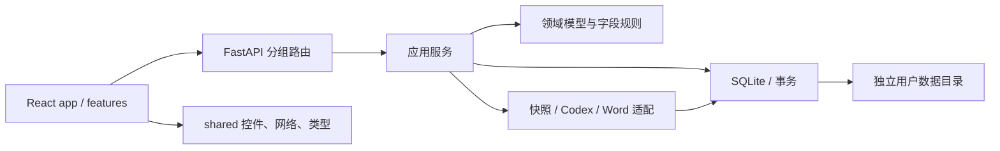

# 架构说明

## 设计边界

项目由一个 Python 本机服务和一个 React 客户端组成。FastAPI 同源提供 API 与前端构建资源，SQLite 保存用户数据；源码仓库不保存个人简历、模板、聊天记录或分析快照。领域规则保留为直接函数，业务服务直接使用短连接数据库，不额外引入 ORM 或通用仓储框架。

## 后端职责

| 位置 | 职责与修改入口 |
| --- | --- |
| `api/app.py` | 创建每个实例的服务容器，统一管理后台任务生命周期 |
| `api/dependencies.py` | 从当前请求的应用读取服务，避免模块全局变量共享用户目录 |
| `api/routes/` | 按 projects、conversations、jobs、resumes、templates、settings、system 拆分 HTTP 入口 |
| `api/schemas.py` | 请求体约束；HTTP 特有字段留在接口层 |
| `api/middleware.py` | Host、Origin、令牌检查和统一错误响应 |
| `api/static.py` | 同源静态资源与首页令牌注入 |
| `core/` | 配置及可展示的业务异常，不依赖业务服务 |
| `domain/models.py` | 经历、证据、组合、AI 输出等数据契约 |
| `domain/experience.py` | 字段读取、替换、排序校验等无副作用规则 |
| `services/catalog.py` | 不可变版本、逐字段草稿、采用冲突和固定组合的事务边界 |
| `services/projects.py` / `conversations.py` / `workspace.py` | 项目维护、会话维护及工作台聚合查询 |
| `services/jobs.py` | 持久队列、上下文快照、建议校验、取消和结果发布 |
| `services/documents.py` | 模板登记、固定版本导出与追溯清单编排 |
| `services/templates.py` | 独立模板分析任务、映射核对、试填和保存 |
| `domain/templates.py` | 字段引文、重复范围、照片和原文处置的声明式映射 |
| `infrastructure/database.py` | SQLite 短连接、即时写事务和 JSON 列编解码 |
| `infrastructure/schema.sql` | 当前完整数据库结构，空库一次性创建全部表和索引 |
| `infrastructure/storage.py` | 跨进程实例锁、在线备份、离线验证和目录切换 |
| `integrations/sources.py` | 本机源码扫描、快照过滤、指纹和原文证据匹配 |
| `integrations/providers/base.py` / `codex.py` | 可注入的 Provider 协议与 Codex CLI 实现 |
| `integrations/word/` | OOXML 区域操作、渲染编排和独立 Word COM 进程 |

依赖约束由 `scripts/check_quality.py` 检查：`core` 不反向依赖任何业务模块；`domain` 不依赖数据库、适配器、服务或 HTTP；`infrastructure` 与 `integrations` 不依赖服务和 HTTP；`services` 不依赖 HTTP。业务错误通过 `core.errors.Problem` 传递，接口层负责转换成响应。

## 前端职责

`app/App.tsx` 负责跨业务导航、刷新和消息提示；布局状态交给 `app/useWorkspaceLayout.ts`。每个 `features/` 子目录维护本功能的组件及状态逻辑：

- `projects`：侧栏、会话入口及稳定排序。
- `experiences`：整段编辑、单条亮点编辑与字段草稿 hook。
- `conversations`：消息输入、建议对比卡和任务事件流。
- `resumes`：固定版本组合 hook、内容预览与真实分页图片。
- `settings`：来源、模板与 Provider 设置。
- `templates`：AI 模板分析、字段和重复区域编辑、原图核对及真实试填。
- `workflow`：制作指引状态推导和步骤定位。

`shared/` 只包含可复用控件、尺寸/请求 hooks、网络和本机缓存工具，以及与 API 对齐的数据类型。经历与会话共同使用 `shared/lib/draftRegistry.ts`：导航、保存和导出前先等待注册的草稿写入，失败时保留编辑现场。共享层不能导入 `features` 或 `app`，业务模块不能导入 `app`；前端质量脚本自动检查这些边界。

样式按 `base → workspace → components → history → responsive` 顺序导入。拆分保持原有选择器顺序和优先级，避免移动文件时改变布局表现。

## 关键数据约束

1. **经历修订不可变**：发布或恢复创建新修订，`parent_id` 表示真实父版本；分支通过 `experience_branches.head_revision` 指向各自最新版本，项目响应中的 `head_revision` 从主分支查询，不在项目表重复存储，不改旧版本正文。
2. **草稿带版本号**：按项目、基础修订和字段定位。保存或删除时检查版本，防止两个窗口静默覆盖。
3. **修改与提交分离**：编辑、增删和排序只写草稿；界面仅通过“提交为新版本”发布整个工作副本。内容未改变时确认草稿，不生成重复修订。前后端统一提交整个工作副本，提交接口仅接收基础修订与预期分支头；逐字段编辑仍写入独立草稿。
4. **简历固定引用**：`ResumeItem` 保存具体 `revision_id` 与 `highlight_ids`；经历更新必须由用户显式用于当前简历。
5. **AI 输出先成为建议**：生成建议记录修改前后内容和来源快照；采用时再次校验原文及事务内状态，采用后仍须人工保存。
6. **任务串行执行、会话相互隔离**：任务以请求标识幂等提交；同一会话只允许一个活动任务。取消后不得发布迟到结果。
7. **来源可追溯**：快照记录读取文本、原文件及存储哈希、Git 状态和遗漏原因，之后的源码修改不改变已有证据。
8. **Word 按确认的映射替换**：手动模板只替换项目区；完整模板按精确引文替换资料、复制条目样式和更换照片。校验节点、重叠范围、未处理原文以及当前资料覆盖，保留样式与页面设置，清除未使用的旧照片资源。渲染在独立进程执行，按 PID 和创建时间核验后回收。
9. **整体与子项目相互独立**：多来源整体项目通过 `project_hierarchy` 关联单来源子项目；经历、草稿、快照、会话和简历引用仍按各自项目标识隔离。导入和来源更新在事务中同步子项目，启动时不再补建数据。来源移除时解除分组并保留旧子项目历史。

经历历史由 `services/history.py` 管理，`revision_branches` 记录修订所属分支。创建分支时追加一个内容相同的起点修订，并可复制来源草稿到新修订的草稿空间；因此两个分支从同一版本出发也不会共享未发布修改。保存、恢复及 AI 建议采用均校验目标分支头，分支指针和修订、草稿清理在一个 SQLite 写事务中完成。历史树按真实父子关系绘制，不按时间猜测；查看旧节点后必须创建分支或追加恢复才能继续发布。项目创建时在同一事务内建立 `main` 与初始修订。经历数据不双写 Git，避免数据库与仓库出现部分提交。

项目详情的 `uncommitted` 列出各基线版本与有效工作副本的实际差异。历史树用 `working:<base_revision>` 临时节点显示这些内容，虚线连接到基线；该标识仅用于展示，不写入 revisions，也不能成为简历引用或分支起点。打开历史窗口前先刷新字段草稿，排序同样使用 `useField` 的本机恢复副本、串行写入和并发版本检查。

## 扩展方式

完整模板复用 `templates.mapping_json` 保存 `{"plan": TemplatePlan}`，工作台返回 `kind=adaptive`；手动项目区模板返回 `kind=projects`。这是两种受支持的导出模式，无数据库升级或历史格式转换。`template_map.py` 给正文、表格、页眉页脚、文本框与图片分配快照内稳定节点，`template_fill.py` 校验后执行替换。模型仅输出声明式映射，模板文字按数据处理。

模板分析复用项目队列的 Provider 实例和设置，使用独立工作区、结果 schema 与取消信号，不占用项目会话。分析任务保存在当前应用实例内存，应用退出时取消并回收；已确认模板另存常规模板目录并进入备份。试填与导出共用填充器，预览使用独立目录，HTTP 路由验证任务归属、文件类型及实例令牌。

- 新增业务接口：在 `api/schemas.py` 定义请求；把规则或事务放入 `domain/` 或 `services/`，再接入相应路由。不要把后台线程放到导入时启动。
- 新增 AI Provider：实现 `integrations/providers/base.py` 的协议，通过 `create_app(provider=...)` 注入。`run` 返回经历建议 `AIResult`，`run_structured` 按指定领域模型生成严格结构化结果；适配器不能直接发布修订或登记模板。
- 新增模板或渲染方式：扩展 `integrations/word/`，保持 DOCX 包保留约束；由 `services/documents.py` 记录结果清单。
- 修改数据库：项目尚未上线，直接维护完整 `schema.sql`，不维护历史升级链。结构变化时更新 `SCHEMA_VERSION`，建库、备份恢复和安装包检查共用该版本；使用新的测试数据目录，不自动转换或清空旧库。
- 修改跨功能 UI：状态协调留在 `app/`，通用机制抽到 `shared/`，先验证草稿刷写、快速切换与异步响应的归属。

`tests/fixtures/api-contract.json` 记录当前接口定义；测试忽略说明文字，核验路径、参数、请求模型及响应格式。修改通信协议时同步更新前端与该契约，不保留旧客户端适配。`resume_maker.api.create_app` 和 CLI 是应用入口。

个人资料和栏目条目由前端工厂生成完整字段，显隐与自定义信息数组始终存在；后端拒绝已停用的 `deleted_fields`。方案保存完整替换资料，`document=null` 表示无完整资料的项目组合；模板项目区导出仍按 `template_id` 选择。浏览器简历草稿使用 `rm.resume.v2.*` 键，直接保存当前结构，不读取或转换旧缓存。

前端“Word 模板”是紧随“栏目编排”的独立功能区。`TemplateAdapter` 持续挂载以保留切换功能区时的人工编辑；`TemplateCanvas` 依据节点祖先关系呈现结构和字段高亮，`TemplateInspector` 编辑当前选区，`AdvancedMapping` 提供完整映射和精确边界，`ManualTemplate` 保留项目区工具。范围选择仅接受相同 Word 部件和直接父节点的同级块；所有人工修改会使校验和试填失效。结构视图不模拟实际 Word 排版，真实分页通过试填结果呈现。

`POST /api/templates/{template_id}/edit` 对已保存完整模板做哈希核验后创建当前实例的独立编辑快照，不调用模型。保存仍生成新的模板 ID，不修改旧模板或已有简历引用。分析、编辑副本和试填都沿用实例鉴权与受控文件路径。

本机路径输入统一使用共享 `PathInput` 组件，调用受实例令牌和来源校验保护的 `POST /api/paths/pick`。`integrations/path_picker.py` 在 HTTP 工作线程初始化 STA 并调用 Windows `IFileOpenDialog`，文件和文件夹都返回文件系统完整路径；取消返回空值。跨请求互斥避免重复窗口，COM 对象与文件名内存在原线程释放，输入路径只决定初始浏览目录，不参与命令执行。多来源输入追加并去重，组件卸载或资料切换时丢弃迟到结果。
