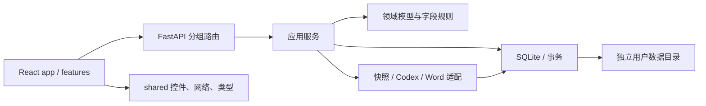

# 架构说明

## 设计边界

项目由一个 Python 本机服务和一个 React 客户端组成。FastAPI 同源提供 API 与前端构建资源，SQLite 保存用户数据；源码仓库不保存个人简历、模板、聊天记录或分析快照。领域规则保留为直接函数，业务服务直接使用短连接数据库，不额外引入 ORM 或通用仓储框架。

## 后端职责

| 位置 | 职责与修改入口 |
| --- | --- |
| `api/app.py` | 创建每个实例的服务容器，统一管理后台任务生命周期 |
| `api/dependencies.py` | 从当前请求的应用读取服务，避免模块全局变量共享用户目录 |
| `api/routes/` | 按 projects、conversations、jobs、resumes、templates、settings、system 拆分 HTTP 入口 |
| `api/schemas.py` | 请求体约束；HTTP 特有字段留在接口层 |
| `api/middleware.py` | Host、Origin、令牌检查和统一错误响应 |
| `api/static.py` | 同源静态资源与首页令牌注入 |
| `core/` | 配置及可展示的业务异常，不依赖业务服务 |
| `domain/models.py` | 经历、证据、组合、AI 输出等数据契约 |
| `domain/experience.py` | 字段读取、替换、排序校验等无副作用规则 |
| `services/catalog.py` | 不可变版本、逐字段草稿、采用冲突和固定组合的事务边界 |
| `services/projects.py` / `conversations.py` / `workspace.py` | 项目维护、会话维护及工作台聚合查询 |
| `services/jobs.py` | 持久队列、上下文快照、建议校验、取消和结果发布 |
| `services/documents.py` | 模板登记、固定版本导出与追溯清单编排 |
| `infrastructure/database.py` | SQLite 短连接、即时写事务和 JSON 列编解码 |
| `infrastructure/migrations/001_initial.sql` | `user_version=1` 的原始数据库结构，已有数据无须转换 |
| `infrastructure/storage.py` | 跨进程实例锁、在线备份、离线验证和目录切换 |
| `integrations/sources.py` | 本机源码扫描、快照过滤、指纹和原文证据匹配 |
| `integrations/providers/base.py` / `codex.py` | 可注入的 Provider 协议与 Codex CLI 实现 |
| `integrations/word/` | OOXML 区域操作、渲染编排和独立 Word COM 进程 |

依赖约束由 `scripts/check_quality.py` 检查：`core` 不反向依赖任何业务模块；`domain` 不依赖数据库、适配器、服务或 HTTP；`infrastructure` 与 `integrations` 不依赖服务和 HTTP；`services` 不依赖 HTTP。业务错误通过 `core.errors.Problem` 传递，接口层负责转换成响应。

## 前端职责

`app/App.tsx` 负责跨业务导航、刷新和消息提示；布局状态交给 `app/useWorkspaceLayout.ts`。每个 `features/` 子目录维护本功能的组件及状态逻辑：

- `projects`：侧栏、会话入口及稳定排序。
- `experiences`：整段编辑、单条亮点编辑与字段草稿 hook。
- `conversations`：消息输入、建议对比卡和任务事件流。
- `resumes`：固定版本组合 hook、内容预览与真实分页图片。
- `settings`：来源、模板与 Provider 设置。
- `workflow`：制作指引状态推导和步骤定位。

`shared/` 只包含可复用控件、尺寸/请求 hooks、网络和本机缓存工具，以及与 API 对齐的数据类型。经历与会话共同使用 `shared/lib/draftRegistry.ts`：导航、保存和导出前先等待注册的草稿写入，失败时保留编辑现场。共享层不能导入 `features` 或 `app`，业务模块不能导入 `app`；前端质量脚本自动检查这些边界。

样式按 `base → workspace → components → responsive` 顺序导入。拆分保持原有选择器顺序和优先级，避免移动文件时改变布局表现。

## 关键数据约束

1. **经历修订不可变**：发布或恢复创建新修订；`head_revision` 只指向最新版本，不改旧版本正文。
2. **草稿带版本号**：按项目、基础修订和字段定位。保存或删除时检查版本，防止两个窗口静默覆盖。
3. **单项发布保留其他草稿**：仅发布目标字段，其余差异迁移到新修订对应的草稿中。内容未改变时确认草稿，不生成重复修订。
4. **简历固定引用**：`ResumeItem` 保存具体 `revision_id` 与 `highlight_ids`；经历更新必须由用户显式用于当前简历。
5. **AI 输出先成为建议**：生成建议记录修改前后内容和来源快照；采用时再次校验原文及事务内状态，采用后仍须人工保存。
6. **任务串行执行、会话相互隔离**：任务以请求标识幂等提交；同一会话只允许一个活动任务。取消后不得发布迟到结果。
7. **来源可追溯**：快照记录读取文本、原文件及存储哈希、Git 状态和遗漏原因，之后的源码修改不改变已有证据。
8. **Word 仅替换登记区域**：保留区域外正文与其他 DOCX 包文件；渲染在独立进程执行，按 PID 和创建时间核验后回收。

## 扩展方式

- 新增业务接口：在 `api/schemas.py` 定义请求；把规则或事务放入 `domain/` 或 `services/`，再接入相应路由。不要把后台线程放到导入时启动。
- 新增 AI Provider：实现 `integrations/providers/base.py` 的协议，通过 `create_app(provider=...)` 注入；适配器返回 `AIResult`，不能直接发布修订。
- 新增模板或渲染方式：扩展 `integrations/word/`，保持 DOCX 包保留约束；由 `services/documents.py` 记录结果清单。
- 修改数据库：保留已发布迁移，新增迁移与版本处理，同时更新恢复校验和数据库回归测试；不能直接重建用户数据目录。
- 修改跨功能 UI：状态协调留在 `app/`，通用机制抽到 `shared/`，先验证草稿刷写、快速切换与异步响应的归属。

`tests/fixtures/api-contract.json` 来自重构前的接口定义；测试忽略说明文字，核验原有路径、参数、请求模型及响应格式。重构无需用户迁移数据库，`resume_maker.api.create_app` 和 CLI 入口保持可用；原平铺内部模块路径已被新目录取代。
