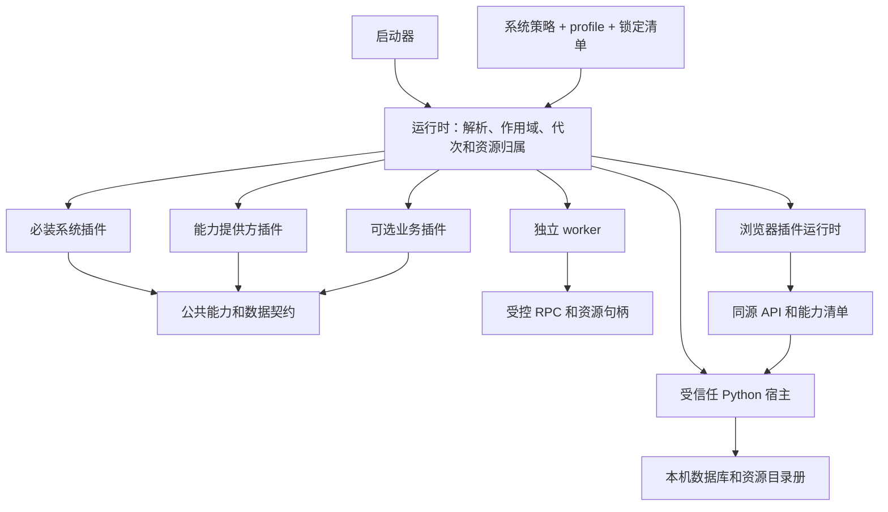
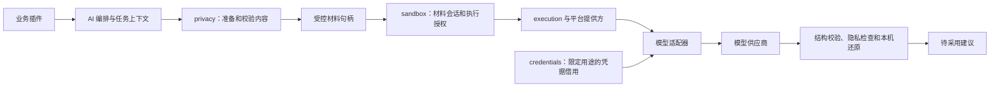

# ResumeMaker 插件化完整目标架构

> 状态：完整目标规范，正在 `codex/plugin-architecture` 分支实施。实际支持范围、验证证据和尚未达标项见 [实施记录](plugin-implementation.md)，本文保留完整目标，不随实现进度删减。
>
> 日期：2026-10-04。改造对象：本地单用户 ResumeMaker，调研源码基线 `e715e2d`。参考：`D:/Python/Obsidian/Agent/deepseek-harness`，本地提交 `5badb15009`。下文新目录、插件 ID、服务名和协议均为目标设计。
>
> 本次复盘将目标架构和迁移顺序分开。目标协议覆盖完整插件生命周期；实施可以分步，但未完成部分应标为未达标，不能通过删减目标定义宣布完成。

## 1. 复盘结论

采用 **小型启动器和运行时 + 必装系统插件 + 可选择的能力提供方 + 可选业务插件 + 声明式产品组合**。保留 Python、FastAPI、SQLite、React 和 TypeScript，当前设计面向本机单用户，不引入服务器账户或多租户需求。

“一切皆插件”落实在每项运行能力上，包括存储、资源、配置、草稿、任务、执行、隐私、sandbox、凭据、HTTP、工作台和简历业务。公共类型及无状态工具可以是库，不要求每个函数成为一个插件。

最小产品仍应完成：手工填写资料、编辑经历、保存不可变版本、编排简历、预览内容、导出 DOCX、备份和恢复。**最小产品是插件的一种组合，完整插件架构必须同时支持更丰富的组合、外部扩展和长期演进。**

系统插件采用统一插件协议，必须安装并激活。系统内部的可替换实现通过明确的提供方角色选择；“具体实现可替换”不允许形成缺失必要能力的产品。AI、源码分析、证书库、模板恢复、OCR、Word 精确渲染和招聘收藏按依赖组合选择。

### 1.1 上版方案需要纠正的内容

| 上版设计 | 问题 | 本次目标 |
| --- | --- | --- |
| 所有插件都同进程、统一发布 | 限制外部插件、依赖冲突隔离和故障恢复 | 明确受信任宿主插件、受控 worker 插件及浏览器入口三类执行位置 |
| 启停和升级一律重启 | 未区分逻辑激活、配置变更、代码替换和数据升级 | 按实际能力声明 live、drain、worker restart、client reload、host restart |
| 前端只加载构建时列举的模块 | 新增完整插件仍必须修改主工程、重新构建主应用 | 定义预构建客户端包、SDK/React 共享规则、资源版本和动态装载协议 |
| 安装、卸载、升级以后再设计 | 无法确定清单、版本、备份及数据所有权 | 当前即定义安装事务、兼容性、迁移、回滚和卸载保留规则 |
| sandbox 同时容纳策略、进程和供应商适配 | 系统机制容易重新绑定 Codex | 分离 sandbox 策略、执行服务、平台提供方和供应商协议 |
| settings 同时管理设置和业务草稿 | 丢失不同冲突、生命周期及保存语义 | 独立 drafts 能力，设置与正式资料保持不同入口 |
| storage 同时管理 SQL、附件和业务目录 | 备份容易继续枚举所有业务实现 | 分离存储事务、资源目录册和插件数据描述 |
| resume 兼任文档引擎注册中心 | 核心业务相互依赖，扩展职责模糊 | 独立 documents 能力，消费不可变导出输入 |
| 权限只有清单字符串 | 容易把声明误当隔离 | 定义权限授予、执行位置、可强制的限制及不受保护的信任边界 |
| 将招聘样板视为插件化主要验证 | 无法覆盖复杂隐私、事务、后台执行和跨窗口问题 | 全量能力归属、复杂场景及失败矩阵共同作为完成标准 |

不要求所有插件都热更，不要求所有插件都跨进程，也不要求增加一个在线商店。需要完整定义每一种支持行为及不满足条件时的结果，不能用“以后考虑”代替协议。

## 2. 参考实现和适用边界

| deepseek-harness 机制 | 已核对依据 | 本项目采用方式 |
| --- | --- | --- |
| 插件贡献服务，消费方声明依赖 | [架构](D:/Python/Obsidian/Agent/deepseek-harness/docs/architecture.zh.md)、[服务](D:/Python/Obsidian/Agent/deepseek-harness/docs/cordis-tutorial/03-services.zh.md) | SDK 声明接口，插件提供实现；消费者不导入实现 |
| effect 和作用域释放 | [生命周期](D:/Python/Obsidian/Agent/deepseek-harness/docs/cordis-tutorial/02-lifecycle-and-effects.zh.md)、[scope](D:/Python/Obsidian/Agent/deepseek-harness/docs/subsystems/scope.zh.md) | 每项注册和执行句柄归属一个作用域，退出需要等待资源停稳 |
| profile、bundle 和配置覆盖 | [base 组合](D:/Python/Obsidian/Agent/deepseek-harness/packages/bundle/base/cordis.patch.yml)、[组合和 HMR](D:/Python/Obsidian/Agent/deepseek-harness/docs/cordis-tutorial/06-composition-and-hmr.zh.md) | 产品组合、稳定实例 ID、确定的覆盖规则、依赖驱动激活 |
| 定义、提供方和消费者分离 | [能力图](D:/Python/Obsidian/Agent/deepseek-harness/docs/capability-seams.zh.md) | 存储、执行、sandbox、模型和文档引擎都有明确替换接口 |
| Host 和 Client 各自模块化 | [客户端清单](D:/Python/Obsidian/Agent/deepseek-harness/packages/client/modules/src/client/manifest.ts)、[界面注册表](D:/Python/Obsidian/Agent/deepseek-harness/packages/client/ui-renderer/src/client/registry.ts) | 分开解析入口依赖，共享产品配置代次和协议版本 |
| 安装、选择和运行状态分离 | [插件管理器](D:/Python/Obsidian/Agent/deepseek-harness/packages/boot/plugin-manager/README.zh.md) | 安装成功不等于激活成功，期望状态和实际状态分别显示 |
| sandbox 报告实际强制能力 | [sandbox](D:/Python/Obsidian/Agent/deepseek-harness/docs/subsystems/sandbox.zh.md) | 使用支持能力报告，不能把应用级约束宣称成完整 OS 隔离 |
| 必需条目启动审计 | [app-boot](D:/Python/Obsidian/Agent/deepseek-harness/packages/boot/app-boot/src/index.ts) 的 `auditStartupEntries()` | 增加更严格的系统完整性校验 |

参考实现中配置顺序不等于激活顺序，依赖可用性决定激活。其必需条目审计会忽略缺席或已禁用的必需 ID；本项目要求系统插件必装，必须明确拒绝这两种情况。其 patch 按条目替换整份 config，也不能解释为任意深合并。

Python 运行时实现相同的关键语义，不直接搬用 Node 的模块重载实现。设计需要尊重 Python 原生库、浏览器 ESM 缓存和 SQLite 事务的实际限制。

## 3. 概念必须分清

| 概念 | 含义 |
| --- | --- |
| 插件定义 | 稳定插件 ID、接口版本、入口、配置和能力描述 |
| 插件包 | 可分发的不可变产物，可以包含一个或多个插件定义 |
| 插件实例 | 一个插件在某作用域中的配置和状态；有独立 instance ID |
| 能力 | 带名称、版本、基数和作用域的服务或扩展点 |
| 提供方 | 实现某能力的插件；同能力可有多个候选 |
| bundle | 一组插件实例及默认配置，不持有运行中的业务对象 |
| profile | 当前应用选中的完整组合及覆盖，必须满足系统策略 |
| 执行位置 | trusted-host、worker、trusted-client 或 isolated-client |
| 系统插件 | 官方产品策略要求的必需插件，普通配置不可关闭 |
| 可选插件 | 用户可安装和启停，但必须满足依赖和已有数据约束 |

插件属于系统还是扩展，由发行策略认定，不能靠自填 `kind: system` 获得身份。插件版本、SDK 版本、能力协议版本、数据 schema 版本和资源产物摘要分别管理。

同一个插件可以有 Host、Worker、Client、维护数据入口，也可以只有其中之一。公共接口的版本和执行位置必须明确，不能让“插件”一词同时指代页面、Python 文件、安装包和进程。

## 4. 整体结构



启动器只处理参数、组合定位、恢复入口和最小诊断。运行时只理解清单、依赖图、生命周期、注册事务和作用域，不了解简历字段、荣誉或模板语义。SDK 不持有业务状态。

所有系统插件的硬依赖闭包只能包含系统插件和系统组合要求的提供方。系统可以公开集合扩展点，但扩展点为空时仍必须完成最小闭环。

## 5. 必装系统插件和提供方

下列为 **18 个系统职责单元**，数量来自明确的所有权边界。它们可共同开发、同包分发，不能因为当前安装包只有一个就失去独立清单和生命周期。

| 插件 | 负责能力 | 与现有代码的关系 |
| --- | --- | --- |
| `sys.storage` | 数据连接、UnitOfWork、事务和 schema 管理 | database.py 的基础能力；不解释荣誉或模板字段 |
| `sys.assets` | 已登记附件、摘要、版本、租约、引用和垃圾回收 | storage.py 中资源管理及各业务的文件登记 |
| `sys.settings` | 分区配置、版本、校验和设置贡献 | settings.py 的通用存储；字段由所有者定义 |
| `sys.drafts` | 草稿版本、删除标记、恢复代次、多窗口刷新屏障 | workspace_storage.py、draftRegistry.ts |
| `sys.activity` | 本机日志、采集策略、凭据遮盖和关联追踪 | activity、observability 和基础诊断 |
| `sys.credentials` | 凭据引用、受限借用、刷新并发控制和撤销 | 从 Codex 凭据使用中抽出通用协议 |
| `sys.execution` | 受控进程执行接口、句柄、流、终止和实际结束报告 | process.py 的通用执行；由平台提供方实现 |
| `sys.sandbox` | 任务策略、材料授权、执行授权及隔离能力核验 | sandbox.py 的策略和会话；不负责识别人名 |
| `sys.jobs` | 调度、持久任务、处理器注册、幂等、取消和结果发布 | jobs.py 及模板/荣誉的重复任务设施 |
| `sys.privacy` | 脱敏、图像保护、敏感值登记、本机还原和发送记录 | privacy 系列、mosaic/page_images 中的保护算法 |
| `sys.http` | 本机访问控制、API 分派、错误转换和资源服务 | middleware、static、应用 HTTP 组装 |
| `sys.workbench` | 布局、主题、导航、命令、扩展点和界面作用域 | App 的通用壳；无扩展业务状态 |
| `sys.plugins` | 包管理、变更计划、兼容性、配置代次和诊断界面 | 调用唯一运行时；不另建加载器 |
| `sys.backup` | 一致性快照、清单校验、离线恢复和目录切换 | storage.py 的备份恢复编排 |
| `sys.experience` | 手工项目、草稿、分支、不可变修订和持久证据引用 | Catalog 的经历部分、History、projects/experiences |
| `sys.resume` | 资料、照片、栏目、固定组合、简历库和来源快照 | Catalog 的简历部分、profile/resumes |
| `sys.documents` | 文档引擎、导入器和渲染器注册，预览/导出编排、成品清单 | documents.py、resume_previews.py 的公共流程 |
| `sys.docx` | 内置版式、基础内容预览和 DOCX 引擎 | full_resume.py 和通用 OOXML 支持 |

从上版 13 项中独立出的 5 项是 assets、drafts、credentials、execution、documents。每项都有独立资源、数据或生命周期需要管理，不能仅为了增加插件数量拆分纯函数。

### 5.1 系统提供方角色

系统插件定义接口和协调规则。以下角色必须解析到满足当前平台要求的实现；默认实现同样作为插件登记。

| 角色 | 基数及本地默认 | 可替换条件 |
| --- | --- | --- |
| 事务存储 | 每数据工作区恰好一个：`provider.storage.sqlite` | 保证同事务引用校验、快照读取和既有 schema 能力 |
| 附件存储 | 每数据工作区恰好一个：`provider.assets.local` | 支持不可变资源、摘要、租约和备份一致性 |
| 平台执行 | 每执行域恰好一个：Windows 或 POSIX 提供方 | 真实报告进程控制和清理能力，不跨执行域混用句柄 |
| sandbox 执行实现 | 每策略明确选择：`provider.sandbox.local` | 保留当前应用层保证；更强要求必须由实际实现满足 |
| 凭据后端 | 每凭据引用明确归属，本地受限引用后端为默认 | 空凭据库也可就绪；不得把凭据混入资料备份 |

提供方注册是基础设施装配阶段：先建立服务注册表，再登记实现，最后按依赖激活消费者。协调器不在激活前要求自己的提供方已存在，否则会造成循环。运行时在业务 ready 前检查角色基数及可用状态。

普通用户不能关闭最后一个必需提供方。替换操作是经过兼容性检查的一次完整变更，旧实现退出前新组合必须可验证。系统存储、执行和保护实现的替换属于受信任代码变更，不能由任意扩展抢占服务名。

### 5.2 最小组合和自由选择

- `minimal`：全部系统插件、当前平台所需提供方、内置 DOCX；不要求模型连接、OCR、Microsoft Word 或额外模板。
- `standard`：系统集合加现有产品能力对应的扩展，环境不支持的可选能力给出明确状态。
- 用户组合：在同一系统集合上增减业务能力，解析所需扩展依赖并显示安装体积、权限和数据影响。
- 维护模式：从可信系统安装读取备份和诊断能力，不加载任意业务插件，不宣称正常业务 ready。

隐私和 sandbox 必装但按需使用；不启用 AI 时不启动 CLI。最小产品显示的是内容预览，不能承诺 Word 精确分页。日志基础设施必装仍遵守现有采集规则，空选暂停采集。

### 5.3 系统主依赖和装配顺序

| 服务层 | 主依赖 |
| --- | --- |
| storage 定义、提供方注册 | 启动配置、运行时作用域 |
| assets、settings | storage 及各自必需提供方 |
| drafts、activity、credentials | storage/settings，凭据后端可用 |
| execution 定义、平台注册 | 运行时作用域、activity |
| sandbox 定义、策略和实现注册 | settings、assets、execution、activity |
| jobs | storage、assets、sandbox、activity |
| privacy | settings、assets、activity；OCR 使用调用时能力，不能反向依赖 jobs 的激活 |
| experience | storage、assets、drafts |
| resume | storage、assets、drafts、experience |
| documents | assets、jobs、resume 的导出读取契约 |
| docx | documents 注册表及纯文档工具 |
| http、workbench、plugins、backup | 消费相关系统接口，按入口分阶段挂载 |

系统服务激活不依赖其设置页先存在。HTTP 和 UI 贡献在各自宿主就绪后注册，避免 settings 和 workbench、storage 和 http 形成反向依赖。documents 定义引擎集合，docx 注册实现，最后检查内置引擎就绪；documents 构造器不导入 docx。

## 6. 业务及可替换能力插件全集

下表覆盖现有功能的归属。插件定义可同包分发，但硬依赖、可选增强和关闭后的行为必须分别声明。

| 插件 | 拥有的功能 | 依赖及缺席行为 |
| --- | --- | --- |
| `ext.source-code` | 来源目录、只读源码查询、证据生产 | experience、privacy、sandbox；缺席仍能手工建项目并查看已存证据 |
| `ext.ai-runtime` | 模型提供方集合、受控调用、流和结构化结果 | privacy、sandbox、jobs、credentials；无模型提供方时 AI 命令不可用 |
| `ext.provider-codex` | CLI 连接、模型目录、协议映射及登录格式 | AI 注册表、sandbox、credentials；取消后不能再发布模型结果 |
| `ext.ai-conversation` | 会话、历史、输入草稿、建议、建议采用 | AI、experience、drafts；源码问答另声明 source-code，普通内容讨论可独立 |
| `ext.honors` | 证书库、人工字段、核对、来源同步 | assets、resume 来源接口；不硬依赖 AI |
| `ext.honor-recognition` | 证书提取和识别任务 | honors、AI、OCR 及所选文件处理能力；手工核对保留 |
| `ext.template-library` | 库、分类、收藏、回收站、模板版本及资源 | assets、documents；关闭不删除引用实体和原件 |
| `ext.template-adapter` | DOCX 节点、人工映射、补位、试填、填充引擎 | template-library、documents；已确认映射不依赖 AI |
| `ext.template-ai` | AI 映射、建议修正及分析缓存 | template-adapter、AI；缺席仍能人工适配 |
| `ext.import-pdf` | 文字层 PDF 恢复、分栏、图形及图标 | documents、template-adapter；原生文字页不必调用 AI |
| `ext.import-image` | 图片和扫描 PDF 的视觉版面恢复 | OCR、privacy、AI、template-adapter；处理失败保留原件并拒绝发送 |
| `ext.ocr` | OCR 服务及算法提供方注册 | 独立定义识别结果；不自行决定哪些文字可外发 |
| `provider.ocr.rapidocr` | 当前 RapidOCR CPU 实现 | OCR 注册表；可被满足结果和资源契约的其他实现替换 |
| `ext.word` | Word 精确预览、PDF、旧 DOC 转换 | documents、sandbox；机器缺少 Word 仅影响这些能力 |
| `ext.recruitment` | 收藏、稳定 ID、分类、排序、JSON 交换及规则 | storage、settings、drafts；关闭后资料保留 |
| `ext.activity-ui` | 日志时间轨道、筛选、关联详情和导出交互 | activity；关闭界面不改变后端采集规则 |
| `ext.workflow` | 制作步骤和引导 | 消费已声明状态贡献，不反向控制各业务生命周期 |
| `ext.native-shell` | 本机路径选择、打开文件和目录 | sandbox 的本机交互策略；保留浏览器上传和下载 |
| 其他模型/导出/识别提供方 | 实现已公布能力接口 | 按角色和执行域显式绑定，不要求修改消费方 |
| 其他资料源、字段、规则、页面插件 | 扩展已有声明式贡献点 | 需要版本化 schema、默认展示和缺失时的保留策略 |

### 6.1 一次功能的全部归属

例如招聘插件同时拥有服务、数据、HTTP、页面、导航、设置、草稿策略、导入导出和测试。启用页面而后台未就绪，或停止后台后导航仍可操作，都不算完成启停。

模块贡献的业务 UI 和最小数据读取器可以具有不同生命周期。**停用交互能力不代表卸载解释持久数据所需的一切信息。** 数据 schema 描述、资源引用目录和已存的可展示快照由系统保留，不靠后台插件一直运行才能备份。

### 6.2 引用完整性和停用语义

| 停用对象 | 系统应继续提供 | 必须停止或明确提示 |
| --- | --- | --- |
| 源码能力 | 项目、修订、已留存证据及固定引用 | 新的源码扫描和查询 |
| 荣誉库 | 简历最近确认的内容快照和历史导出 | 来源同步；缺快照时先补齐，失败则拒绝停用 |
| 自定义模板引擎 | 原件、映射、模板引用、简历内容和历史成品 | 重新按该模板排版；用户可明确选择另存内置版式 |
| AI 会话 | 保存的会话、建议和输入草稿 | 新模型调用及依赖该插件的采用命令 |
| Word | DOCX 生成、内容预览和已有 PDF 文件 | 新的 Word 精确分页或 PDF 渲染 |
| 未知扩展字段 | 原始数据、schema 版本、资源引用和默认展示快照 | 无相应验证器时编辑该字段或无提示忽略它导出 |

普通简历保存必须保留未知扩展字段，采用所属字段的局部更新或原样透传；不能经旧模型重新序列化时删掉未知字段。新字段存放在带命名空间的扩展区域，不任意改变系统必需字段语义。

## 7. 依赖、能力和作用域

### 7.1 依赖图包含哪些边

每个入口分别声明：

- **硬服务依赖**：缺少则不能激活，含协议版本、基数和作用域。
- **可选能力**：不存在仍可激活；增强行为通过独立子作用域附接和释放。
- **插件依赖**：只有要求特定插件身份、资源或数据解释器时使用，不代替一般服务依赖。
- **远端接口依赖**：浏览器或 worker 需要宿主 RPC；不能据此让宿主等待浏览器。
- **安装依赖**：Python/原生库/静态资源；与运行时能力依赖分别解析。
- **数据兼容依赖**：当前插件能读写哪些版本和来源类型。
- **提供方角色及执行域**：明确选择一个或多个实现，以及具体选择规则。

启动时已知必需服务缺失、版本冲突或依赖环立即报错并列出链路；不能永远 pending。可选提供方暂不可用可以成为可解释的能力状态，但不能把必须的数据或隐私服务当可选项。

同作用域唯一服务发生重复注册时拒绝。集合能力允许多项，但注册 ID 唯一、显式排序；选中结果写入任务和导出清单。同分候选冲突必须要求明确选择或使用事先定义的确定规则，不依赖安装顺序。

### 7.2 服务契约

每项能力至少描述：服务 ID、接口版本、调用方、输入输出 schema、错误、幂等、取消、超时、事务参与方式、作用域、资源所有权和数据分级。

服务定义放在版本化 contracts/SDK 中，实现留在所有者插件。使用类型化 `require(ServiceKey)`，运行时验证清单授权；不能通过一个万能 Context 任意查找所有插件内部对象。

提供方在被选中时同时核验协议兼容和实际能力，例如图片支持、结构化输出、取消、OCR 坐标、精确分页。插件“active”不代表所有服务操作都可执行。接口不得使用任意 `getattr` 或默认开放权限来兼容缺失方法。

对长期任务，将插件版本、配置代次、提供方和参数快照固定到任务上下文。在新提供方切换后，旧任务继续使用原租约，或者被显式取消；不能在半次任务中改用另一实现。

权限撤销和保护策略收紧独立于普通配置快照。它们推进授权代次，旧任务的下一次受控操作必须重新核验；无法重新准备材料时取消任务。已经发送的请求无法因此撤回，界面和发送记录需要如实区分。

### 7.3 作用域

| 作用域 | 主要持有内容 | 释放条件 |
| --- | --- | --- |
| 安装环境 | 包目录、依赖锁、可验证产物 | 无活动实例或版本引用后可回收 |
| 应用实例 | 服务注册表、HTTP 分派、插件状态 | 宿主停止 |
| 数据工作区 | SQLite、资源目录、恢复代次 | 数据目录关闭或切换 |
| 插件实例/配置代次 | 路由、事件、处理器、配置快照 | 插件停用、替换或应用关闭 |
| 浏览器窗口 | 导航、表单、UI 订阅和未提交输入 | 窗口关闭或刷新完成 |
| 编辑会话/项目 | 选中版本、业务草稿和受控查询 | 显式离开或切换；持久草稿不因此删除 |
| 任务 | 取消、临时目录、进程句柄、隐私还原表 | 实际完成和清理结束 |
| 请求 | 事务、路由代次租约、追踪信息 | 请求结束；提交后的工作显式转为任务 |

子作用域可收窄权限，不能扩大父授权。共享服务不保存单任务身份映射。项目、会话、窗口和工作区 ID 不能相互代用。持久状态不以进程内对象地址作为标识。

### 7.4 事件和业务调用

| 机制 | 使用范围 | 约束 |
| --- | --- | --- |
| 服务命令/查询 | 保存、采用、版本发布、冻结导出输入 | 明确返回错误和一致性；原子操作共享业务事务 |
| 提交后通知 | 页面失效、状态刷新、非关键观测 | 只在提交后发出；消费者不能参与决定已提交操作是否成功 |
| 持久 outbox | 崩溃后必须继续执行的动作 | 同事务写入；至少一次交付、消费者幂等、失败可查看 |
| 有序处理管线 | 隐私处理、引用校验、产物发布 | 明确阶段和准入条件，不允许任意监听器取消必需保护 |
| 可选增强作用域 | 提供方出现时增加预览器或设置项 | 依赖消失先撤销贡献，再释放相关资源 |

事件带事件 ID、类型版本、来源插件、配置代次、关联 ID、实体 ID 和实体版本。广播优先传引用和摘要；不得传播凭据、还原表或不必要的真实正文。通知错误不把已提交的业务事务伪装成失败，必须通过日志和重试机制独立处理。

## 8. 清单、组合和版本锁定

### 8.1 插件清单示例

以下展示关键字段，所有字段都属于完整清单 schema；未使用项可省略，但不能由加载器任意猜测。

```json
{
  "manifest_version": 1,
  "id": "ext.recruitment",
  "version": "1.0.0",
  "package": "resume-maker-recruitment",
  "host_api": ">=1.0.0 <2.0.0",
  "client_api": ">=1.0.0 <2.0.0",
  "instances": {"scope": "workspace", "multiple": false},
  "entrypoints": {
    "host": {"mode": "trusted-host", "entry": "resume_recruitment.plugin:activate"},
    "client": {"mode": "trusted-client", "entry": "client/index.js"}
  },
  "requires": {
    "host": {
      "storage": ">=1.0.0 <2.0.0",
      "settings": ">=1.0.0 <2.0.0",
      "drafts": ">=1.0.0 <2.0.0",
      "http": ">=1.0.0 <2.0.0"
    },
    "client": {"ui.slots": ">=1.0.0 <2.0.0"},
    "remote": {"recruitment": ">=1.0.0 <2.0.0"}
  },
  "provides": {
    "host": {"recruitment": {"version": "1.0.0", "cardinality": "one"}}
  },
  "contributes": {
    "pages": ["recruitment.bookmarks"],
    "commands": ["recruitment.import", "recruitment.export"],
    "settings_sections": ["recruitment.preferences"],
    "draft_types": ["recruitment.editor"]
  },
  "config_schema": "schemas/config.json",
  "data": {
    "schema_version": 1,
    "reads": [1],
    "writes": [1],
    "descriptor": "schemas/data.json",
    "migrations": [],
    "backup": true
  },
  "permissions": ["storage.own", "drafts.own", "ui.contribute"],
  "lifecycle": {
    "toggle": "drain",
    "config_update": "live",
    "host_code_update": "host-restart",
    "client_code_update": "client-reload",
    "deactivate_timeout_seconds": 30
  },
  "compatibility": {"execution_domain": "local-workspace"},
  "artifacts": {"index": "artifacts.json"}
}
```

`remote` 是 Client 对 Host 的依赖，不是 Host 的自依赖。数据迁移脚本、前端 chunk、样式、许可证、Python 包和原生资源都必须出现在 artifacts 清单中，并包含摘要。

能力和插件协议采用明确定义的 SemVer 范围；Python 依赖使用 PEP 440，由包构建映射并验证，不能混用比较算法。系统组件允许声明同发行版本约束，普通业务扩展通过 SDK 兼容区间独立发版。修改契约语义必须提升相应版本，不能只保持字段形状。

### 8.2 组合与配置覆盖

系统策略是约束集合，不参与可被覆盖的优先级。配置按以下顺序形成候选快照：

1. 插件声明的默认配置。
2. profile 指定顺序的 bundle。
3. 当前工作区的持久覆盖。
4. 本次启动的显式覆盖。

实例使用稳定 ID 定位。支持声明式的添加实例、删除可选实例、设定 enabled、绑定 provider、整体替换 config、按 schema 允许的字段设值/重置。数组默认整体替换；删除和重置使用明确操作，不能把 `null` 同时解释成业务值和删除命令。

每次生成“有效配置 + 每字段来源 + 冲突诊断 + 配置摘要”，完成验证后才可应用。未知字段、重复实例、保留命名空间和违反系统策略的覆盖明确失败。配置不执行 Python/JavaScript，不携带密钥原文。

### 8.3 锁定和状态

锁定清单记录插件包版本及摘要、SDK/运行时版本、Python/原生依赖、前端资源、平台、启用选择和提供方绑定。启动不自动取 latest，不自动安装缺包。

安装、期望 enabled、Host 状态、Client 状态、能力状态、数据兼容状态和配置代次分别查询。某窗口的 UI 异常不能被报告为所有窗口插件都失败；后台不可用也不能只隐藏菜单而不显示原因。

## 9. 插件生命周期和配置变更

### 9.1 状态机与激活事务

运行状态至少包含 `discovered → validated → resolved → preparing → activating → active → draining → stopped`，以及 `disabled`、`blocked`、`failed`、`cleanup-failed`。数据准备状态单独记录，不能把“包已下载”或“迁移完成”当成插件 active。

激活分为：读取无副作用清单 → 解析依赖 → 数据兼容预检 → 建立注册作用域 → 登记服务与贡献 → 健康检查 → 发布。服务定义和集合注册表先建立，提供方登记后再检查消费者要求，避免装配环。

激活期间的路由、菜单、事件和处理器先进入候选注册集，通过验证再发布。失败时撤销此次注册并按逆依赖清理。激活函数不得随意修改用户正式资料；数据初始化和迁移走明确的维护事务。

所有持有资源的动作返回幂等 disposer，重复关闭等待同一个完成结果。需要顺序的清理步骤显式逐项 await；不能假设异步清理天然有序。清理超时保留故障记录和资源所有权，不能假报 stopped 或删除仍被进程使用的目录。

### 9.2 不同变更需要不同生效方式

| 变更 | 允许方式 | 必须满足的条件 |
| --- | --- | --- |
| 无状态配置，例如显示筛选 | live | schema 标记可实时更新，处理函数可回滚 |
| 已安装代码的逻辑启停 | live 或 drain | 注册可撤销，无在途事务；有任务时先等候或取消 |
| 任务使用的模型、规则或引擎选择 | 新任务使用新代次 | 旧任务固定旧快照，不能中途混用 |
| worker 代码或依赖更新 | worker restart | RPC 兼容、任务排空、新 worker 健康检查成功 |
| 前端插件逻辑更新 | drain + 重新挂载，必要时 client reload | 保存草稿、撤销订阅和样式；模块或 React/SDK 约束不满足时刷新窗口 |
| 宿主 Python 代码、原生库或解释器依赖更新 | host restart | 切换不可变环境，不能依赖删除 sys.modules 安全卸载 |
| 业务 schema 更新 | 维护模式，按需 host restart | 写入冻结、备份、副本迁移和兼容性检查 |
| 存储实现、数据目录或系统执行实现替换 | 维护切换 | 没有活动写事务和资源租约，验证恢复方案 |

这是一套完整的生命周期协议。插件声明能力，运行时根据影响范围选择所需最严格方式，并通过测试验证声明。并非清单写了 live 就允许热更新数据库连接。

开发 HMR 使用相同作用域释放规则；它可以触发受控重启，但不得成为跳过数据兼容检查的生产入口。

### 9.3 变更计划和应用事务

管理器为安装、启停、配置、提供方切换、升级和卸载生成 `ChangePlan`，至少包含：

- 基于哪个配置代次计算，计划 ID、摘要和有效期。
- 直接变更及反向依赖闭包、需重建的入口、数据兼容影响。
- 活动任务、请求、资源租约、所有已连接窗口的草稿状态。
- 新权限、包来源、依赖及磁盘空间变化。
- 可执行的应用方式、预计中断范围及回滚条件。

用户确认的是这份具体计划。实际应用以 expected generation 做并发校验；包摘要、权限、数据状态或影响范围变化时，旧计划失效。运行时串行提交组合变更，不允许两个窗口分别覆盖彼此的插件选择。

应用顺序：

1. 在独立暂存区准备包、资源和可启动环境，不修改当前活动环境。
2. 校验候选组合及系统完整性，预运行独立的兼容/健康检查。
3. 进入准备排空状态：停止接收受影响的新业务命令，但保留专用草稿刷新通道。
4. 通知全部窗口冻结相关编辑；先刷新领域草稿，再刷新最终工作区草稿并取得确认。
5. 等待在途写事务结束，关闭刷新通道，等待或明确取消任务和请求租约。
6. 执行需要的数据维护，构造新注册集或启动新进程；检查必需能力。
7. 原子发布服务注册集和配置代次，通知窗口重建、刷新或重新协商。
8. 旧代次无租约后清理资源，记录完整结果。

内存注册集可通过单次指针切换发布；磁盘配置、维护日志和数据库不具有共同的天然原子事务。持久提交标记是崩溃恢复的判据，启动时根据记录完成切换或恢复，不声称多个文件与 SQLite 同时原子提交。

候选环境的提前健康检查使用合成数据或工作区副本。涉及正式数据的 Host 切换必须先让旧进程停止并释放实例锁，再由新进程取得锁；不能让两个宿主同时作为同一数据目录的写入者。

未响应窗口、冲突或保存失败会阻止无损 live 切换。用户可以另行选择重启操作，但需显示未确认草稿的事实，保留可恢复输入；不能把等候超时当作确认。离线窗口重新连接时核验配置及恢复代次，禁止将旧草稿自动写入新上下文。

### 9.4 回滚与恢复

- 提交前失败：活动组合保持原样，撤销暂存注册和不再需要的环境。
- 配置或提供方切换失败：仅在旧代码及数据仍兼容时恢复旧代次。
- 迁移后失败：按照维护计划恢复整份数据快照或进入只读维护状态，不能只回退代码。
- live 变更不要求所有浏览器同时成功挂载；后端提交一次后，失败窗口显示局部失败并允许重试。不能把网络断开的浏览器纳入分布式原子提交承诺。
- 系统依赖出现运行故障：撤销受影响入口、停止其新写入，并进入明确诊断状态。可选插件失败隔离到其依赖闭包。
- 宿主崩溃后根据维护日志判定正在准备、切换还是已提交。持久任务标记中断，沿用显式重试规则，不自动重复模型调用。

## 10. 安装、升级、卸载和分发

### 10.1 插件包格式

插件包包含：manifest、Host wheel 或 Worker 运行描述、预构建 Client ESM/CSS、schema、迁移入口、静态资源、能力说明、许可证、依赖锁及 artifacts 摘要清单。可以没有某种入口，但不能缺失清单承诺的文件。

支持的来源是本机插件包、已配置的包源和开发目录。包源提供检索、元信息和下载适配接口；图形化在线市场是使用这些接口的产品页面，不是安装协议存在的前提。

安装前只读取和验证数据清单，不 import 插件模块。拒绝包内越界路径、未登记资源、摘要不符和不兼容入口。校验签名可以证明发布者身份，不能证明代码安全。身份冲突和同版本不同摘要需明确报错。

### 10.2 安装事务

完整过程是：inspect → resolve → download/stage → verify → environment prepare → data compatibility plan → apply → health check → commit。每一步都有进度、取消条件和可恢复的操作 ID。

取消在应用提交前清理本次暂存；进入不可中断的数据切换后返回当前阶段，等待完成或受控失败，不能直接杀掉迁移进程。网络响应丢失后通过操作 ID 查询实际结果，不能凭超时推断失败。

安装和启用是两个选择。安装成功后只有通过组合、权限和数据检查才激活。移除包和删除资料也是两个选择，不能捆绑。

### 10.3 Python 依赖环境

- trusted-host 插件共享解释器。它们的依赖必须统一解析；冲突时拒绝该组合，并给出冲突包和区间。
- 每个宿主环境代次不可变。准备新环境后切换进程，禁止在运行中的应用 venv 里就地 pip/uv upgrade。
- worker 插件可以有独立环境及依赖版本，经 RPC 消费宿主能力。独立进程本身不提供权限隔离，见第 15 节。
- 同一宿主环境对同一插件定义只装载一个代码版本；多实例共享代码但配置和作用域独立。多代码版本并存需要独立 worker/环境及不同实例绑定，不能靠修改全局 Python 导入路径实现。
- 不传递 SQLite 连接、Python 类实例或进程句柄跨解释器。跨进程只使用版本化 DTO、资源句柄和取消/进度协议。
- 安装无需源码编译的完整预构建包时不应执行任意安装脚本。必须构建或执行扩展脚本的包，应在计划中明确列出执行内容与环境要求，不能藏在普通更新里。

### 10.4 更新、固定和撤销

支持检查兼容更新、固定版本、预演更新和查看变更日志。默认不在后台自动升级执行代码。多插件联合升级一次解析并生成完整锁定清单。

系统插件及核心 SDK 可以声明发行版本耦合；更新管理器按兼容组整体切换。独立业务插件可以独立更新，但必须通过 Host、Client、数据和能力兼容检查。不能让前端 2.x 配对后端 1.x 后依靠运行时碰运气。

停用保留代码和资料；卸载先排空、检查依赖和引用、撤销入口，再删除无租约代码包。资料、资源目录册和未知字段保留。删除资料必须由独立操作列出引用、快照和附件范围，且不能删除其他插件拥有的共享资源。

## 11. 后端接口、事务和任务

### 11.1 从集中容器到窄服务接口

[app.py](../src/resume_maker/api/app.py) 当前列举构造器、服务观测、路由和 start/stop；[dependencies.py](../src/resume_maker/api/dependencies.py) 列举全部服务。目标由插件注册替代这两份业务清单。

路由按请求获取所需公开服务接口和当前代次，不领取万能 Services。自动观测在服务注册和任务边界接入，仍保留日志类别过滤、凭据遮盖和来源关联。

[Catalog](../src/resume_maker/services/catalog.py) 按经历、简历和 AI 建议采用拆分。领域规则继续为直接函数，不因插件化引入通用 ORM 或把每个方法改成消息。

### 11.2 保留跨模块原子语义

系统使用一个业务 SQLite 和统一 UnitOfWork。参与同一业务命令的受信任 Host 服务共享一个事务，不各自提交。普通插件不能直接读写他人表；接口提供所需的事务内操作。

“采用建议”在同一事务中检查建议状态、原文、基础修订和分支头，再写草稿及采用状态。“保存简历”在同一事务中检查版本、修订归属、亮点、来源和模板状态，再保存固定引用与内容快照。

worker 不可进入宿主 SQL 事务。它先返回可验证结果，再由宿主命令在一个事务中检查预期版本并提交。多步外部 I/O 先准备、后校验提交；不长期持有 SQLite 写锁等待模型、OCR 或用户。

跨进程插件需要影响两个所有者时，使用系统公开的组合业务命令或受限事务参与接口，不能通过两次 RPC 假设原子性。没有原子要求的动作使用 outbox 和幂等执行。

### 11.3 通用任务的完整契约

[现有 jobs.py](../src/resume_maker/services/jobs.py) 的任务绑定项目和会话，模板及荣誉另有任务状态。目标通用任务需要统一元数据：

`job_id`、所有者插件/实例、处理器 ID/版本、请求 schema、实体引用、幂等键、配置及权限代次、提供方绑定、状态、进度游标、取消原因、执行句柄、结果引用和发布时间。

业务专有的 project/conversation/template 关系仍由业务所有者解释。当前旧 jobs 和 settings 中任务状态需要显式转换，不允许简单更名后声称统一。

处理器声明是否可重试、可恢复、可暂停，以及资源并发键。模型调用、OCR 和 Word 各有合适的限流/串行规则。超时、取消和失败区分：

- jobs 发取消请求；execution 报告进程实际结束，sandbox 负责对应会话清理。
- 取消已请求不等于已终止，单次不可中断 OCR 完成前仍占执行租约。
- 发布结果前再次检查任务状态、配置代次和业务版本，迟到结果不得写入草稿。
- 幂等键防止重复提交和重复发布，不承诺第三方模型请求绝对只发送一次。
- 重启后任务中断，不自动重放可能产生费用或外部副作用的操作；恢复或重试需符合处理器明确策略及现有用户确认规则。

### 11.4 HTTP 的动态贡献

根宿主保留本机 Host、Origin、实例令牌和错误处理。插件路由登记到不可变的路由注册快照，由稳定分派层根据插件及代次转发；逻辑启停不直接就地修改活跃 FastAPI 路由数组。

新插件默认使用命名空间路径。现有公开路径可以通过声明的兼容路由贡献保持，检查路径/方法唯一和保留前缀，不能重新增加集中 switch。OpenAPI 按路由代次生成和缓存。

请求取得路由代次租约后使用同一服务集合结束；切换时旧请求排空，新请求走新注册集。被停用能力返回稳定的不可用错误和原因，管理接口保留诊断入口。客户端代次不匹配的写入必须拒绝并保护草稿。

## 12. 数据、资源、迁移和备份

### 12.1 所有权和最小系统数据

继续使用一个业务数据库和独立 `logs/activity.sqlite`。插件化不要求每个模块一个数据库。正式数据、草稿、配置、日志、运行临时状态和缓存各有明确策略。

| 数据 | 所有者 | 关闭扩展后的要求 |
| --- | --- | --- |
| 项目、修订、经历草稿、分支、证据快照 | experience；草稿基础设施提供版本机制 | 历史引用仍可读取，原源码目录不自动访问 |
| 简历、删除标记、资料和来源内容快照 | resume | 固定 revision_id/highlight_ids，未知扩展数据保留 |
| 模板引用实体、资源引用和外部类型标签 | 系统资源及引用契约 | 外键和原件不依赖模板界面活跃 |
| TemplatePlan、分类、回收站及分析状态 | 相应模板插件 | 可保留为不透明数据，缺引擎不静默替换版式 |
| 会话、消息、建议及 AI 业务关系 | ai-conversation | 保留本机历史和输入，不续用旧供应商会话 |
| 荣誉、证书及核对状态 | honors | 简历留有确认内容快照，停止来源同步 |
| 招聘收藏和合并规则 | recruitment | 稳定 ID、并发版本、导入规则保持 |
| 一般工作区草稿、删除版本和恢复代次 | drafts | 失活插件草稿不被清除或自动提交 |
| 正式配置、偏好 schema | settings 与各声明者 | 内容冲突和偏好最后写入策略明确区分 |
| 任务、变更计划、插件 schema 目录 | jobs、plugins、storage | 进程崩溃后可判定真实状态 |
| 凭据、隐私还原表、日志 | credentials、privacy、activity | 分别遵守专有保留策略，不能混入普通资料包 |

插件数据描述包含所有者、schema 版本、引用类型、备份方式、默认展示、缺失插件时的保留方式、删除及兼容规则。资料区分关键系统数据和扩展数据，未知系统格式不允许继续写入。

数据描述和默认展示是受限的非可执行格式，不能包含需要恢复时执行的 Python、JavaScript 或任意 SQL。真正的业务迁移和校验代码只从已验证安装包的维护入口加载。

### 12.2 资源目录册和文件事务

每份附件登记资源 ID、所有者、内容摘要、版本、相对路径或后端标识、媒体类型、来源、引用及备份策略。原件不可变，预览缓存可再生成，临时材料和凭据不登记为可备份资料。

SQLite 提交和文件移动不是天然原子操作。目标采用明确的发布流程：

1. 在拥有归属记录的 staging 区写入完整产物，计算摘要并确保内容落盘。
2. 发布到不可变资源位置；未登记的资源对业务不可见。
3. 同一数据库事务登记资源、引用和业务结果。
4. 提交后才对用户可见。崩溃留下的孤立文件根据维护记录延迟回收，不能在启动时盲删。
5. 删除先解除引用并写 tombstone，无活动租约和备份引用后再物理回收。

模型、Word 或其他插件不能绕过该流程就地覆盖已登记原件。预览、导出和备份读取资源租约；清理不能删除仍被它们使用的文件。

### 12.3 schema 和升级设计现在确定

当前 [database.py](../src/resume_maker/infrastructure/database.py) 的结构版本为 6，仅接受空库或当前版本；仓库约定维护完整 [schema.sql](../src/resume_maker/infrastructure/schema.sql)。目标增加插件数据版本目录及迁移协调器，需要在实施时同步修改数据库约定和文档，当前尚不存在该能力。

完整协议包括：每插件初始化、读写兼容区间、顺序迁移步骤、前置依赖、摘要、是否可逆、校验器和恢复要求。系统协调执行，插件只能修改自己拥有的数据。外键和跨模块引用要求使用公开类型及受控迁移计划。

安装但禁用插件的结构仍保留。迁移需要运行插件数据入口时，仅加载已验证且获准的维护入口，不启动业务任务、界面或模型。缺少代码时，不执行备份自带代码。

对现有真实资料，在停止业务写入后备份并在副本转换；校验数据库、版本、引用、附件及关键行为后切换。不得根据“尚未上线”推断用户本机数据可以被清空。

每次升级有恢复点。不能迁移的数据拒绝升级；未知更高版本拒绝写入。代码回退仅在数据读写兼容时允许，否则恢复整份预升级快照，并明确会丢失恢复点后的变更，因此不能自动执行破坏性回退。

### 12.4 一致性备份和离线恢复

备份使用统一写入协调和资源租约，取得数据库与已登记不可变附件的一致快照。所有插件的资料都由已存目录册枚举，包含已禁用、卸载或暂缺代码的插件。备份过程不依赖活动插件回调才能发现其文件。

备份包含数据库、必要附件、资料 schema 描述、插件 ID/版本、摘要、锁定信息和可审查配置快照。原源码、CLI 登录、临时材料、还原表、活动日志和可重建缓存保持当前排除规则。隐私发送记录继续遵守现有资料备份约定，不能误当不含正文的普通日志。

恢复先校验路径、摘要、清单、数据库完整性、外键和资源，再在隔离目录准备目标，持有实例锁切换，轮换草稿恢复代次并保留旧目录。

缺少扩展时保留其原始数据和附件，显示待安装能力；不自动联网安装备份指定的代码。可验证基本结构但缺少业务校验器的数据保持隔离/只读，不能宣称全部业务语义已验证。未知系统 schema 拒绝作为可写工作区恢复。

## 13. 隐私、sandbox、执行和凭据

这四项都是系统能力，分别定义内容保护、任务授权、平台执行和凭据使用。任何业务插件不得提供旁路模型入口。

### 13.1 完整职责

| 能力 | 拥有内容 | 不能越界承担 |
| --- | --- | --- |
| privacy | 敏感值、替换规则、图片保护、输出还原、发送材料记录 | 供应商登录协议和进程启动 |
| sandbox | 任务策略、读写/工具授权、受控材料会话、能力准入 | 人名识别、模型业务决策 |
| execution | 工作进程句柄、输出流、实际终止、平台回收 | 直接给普通业务暴露无约束执行入口 |
| credentials | 不透明凭据引用、借用范围、刷新锁、撤销及遮盖登记 | 将密钥写进提示词、插件 manifest 或普通配置 |
| provider-codex | Codex 协议、配置映射、模型目录和登录格式适配 | 自行放宽系统策略和继承任意用户工具 |

通用执行接口仅接受有效的执行授权。sys.sandbox 消费 execution 服务及平台提供方，execution 不反向依赖 sandbox 服务；授权格式和校验原语在 SDK/runtime，避免循环。实际进程 API 仅对允许的系统组件开放。这是受信任插件的应用协议，不声称能够阻止同进程恶意代码自行调用操作系统。

### 13.2 模型出口和动态材料



受控材料句柄绑定任务、插件实例、资源摘要、隐私规则版本、允许用途、有效期和配置代次；不能仅传一个可随意修改的 `sanitized=true` 标志。修改内容后原授权失效。

按需源码工具每次执行“授权查询 → 本机读取 → 脱敏 → 返回受控片段”。完整初始提示词已脱敏不代表后续工具结果可直接发送。保留多来源分页、原始行号和可继续游标，不随插件化新增整库文件数预算。

提示词、schema 说明、历史上下文、OCR 文字、图片及工具结果分别进入相应保护通道。身份值可以在本机还原，凭据不可还原；还原表仅在本任务内存中存在。取消、错误日志和重试均不得泄露它。

OCR 是可选提供方。请求需要 OCR 而不可用时拒绝该操作，不发送原图，不把低置信度文字默认视为安全。内嵌图片马赛克、扫描页文字重绘及低置信度整行保护归 privacy；更换模型适配器不能改变这些要求。

### 13.3 本机策略和实际保证

不同任务使用不同受控策略：

- `model.readonly-materials`：模型工具只能读取本轮脱敏材料，不提供 shell、通用文件读取或旧供应商会话。
- `document.local-render`：可信 Word worker 读取明确登记的真实资料副本并输出本地文件，原件保持不变。
- `source.authorized-read`：授权来源的只读查询，继续排除应用数据、沙箱、凭据、链接和既有排除范围。
- `native.user-action`：明确的本机文件选择、打开文件或目录交互，不扩展为任意模型工具。

保存和本机导出使用真实资料，不把脱敏文本写回用户正式简历。运行目录保留当前项目下 ResumeMakerSandbox 和安装包用户目录下的既定规则，控制文件、CLI home 与 tmp 层次关系保持。

sandbox 提供方报告目录权限、模型工具限制、进程回收、文件强制限制和网络强制限制等独立事实。当前实现使用应用层约束、ACL、CLI 严格配置及 Job Object；Job Object 用于进程生命周期，不是完整文件或网络沙箱。

任务要求的保证与提供方报告逐项匹配。不满足时停止该操作并说明，不能将 partial 视作 full，也不能自动选择更宽松执行方式。当前模型任务沿用已验证的应用层保证，不虚构当前已有 OS 强隔离。

更强隔离实现是可注册提供方，和配套 execution 使用相同执行域。容器或虚拟机可作为另一个实现，但不是本地最小产品的依赖。

### 13.4 凭据与日志

凭据由引用定位，限制到指定适配器、目的和任务，不进入普通配置、UI 状态或广播事件。Codex 文件登录格式及刷新解释留在其适配器；通用刷新锁和版本比较由 credentials 协调。保留原凭据未变化才写回刷新的现有规则。

最小系统可在无凭据时启动。现有文件登录不等于新增了静态加密；支持新的 OS 凭据后端需要独立提供方和明确兼容承诺。隐私发送记录与活动日志分开，不把 prepared 或 cancelled 当成供应商肯定未收到请求的证据。

### 13.5 现有代码归属必须按职责提取

| 现有文件 | 目标归属 |
| --- | --- |
| [privacy.py](../src/resume_maker/integrations/privacy.py)、privacy_text、privacy_identifiers、privacy_store | sys.privacy |
| [mosaic.py](../src/resume_maker/integrations/providers/mosaic.py)、[page_images.py](../src/resume_maker/integrations/providers/page_images.py) | privacy 的图片算法；OCR 调用使用公开接口 |
| [sandbox.py](../src/resume_maker/integrations/providers/sandbox.py) | 目录/权限迁 sandbox 或本地提供方；Codex 定位和 TOML 编码留适配器 |
| [process.py](../src/resume_maker/integrations/providers/process.py) | 通用执行和回收迁 execution；CLI 消息解释留适配器 |
| [cli.py](../src/resume_maker/integrations/providers/cli.py)、model_catalog、connection | provider-codex，负责准确落实系统策略 |
| [credentials.py](../src/resume_maker/integrations/providers/credentials.py) | 通用借用/并发归 credentials，登录格式归适配器 |
| material_server、source_broker、[source_access.py](../src/resume_maker/integrations/source_access.py) | 协议适配、材料授权、来源检索和脱敏分别归属，禁止直接绕过出口 |

公共错误和数据类型先归入 SDK，系统插件不能继续反向依赖供应商的 base 模块。Windows ACL 与 Job Object 也使用 pywin32，因此该依赖不能随着 Word 插件关闭一并移除。

## 14. 前端插件和文档扩展

### 14.1 工作台的职责

[App.tsx](../frontend/src/app/App.tsx) 只保留布局、当前页面、通知、通用选择和扩展点渲染。业务状态归对应插件，跨经历和简历的协调归明确的业务命令或 sys.resume，不再回到壳里集中处理。

| 扩展点 | 贡献内容 |
| --- | --- |
| workspace.pages/navigation/panels | 页面、导航、侧栏、会话、日志和预览面板 |
| workspace.commands/shortcuts | 命令、快捷键、可执行条件和冲突规则 |
| settings.sections | 配置表单、校验、草稿和生效方式 |
| drafts.handlers | 刷新、恢复和离页确认 |
| resume.sources | 经历、荣誉及其他内容来源 |
| resume.fields/sections | 字段编辑器、栏目 schema、默认展示和未知数据保留 |
| resume.actions | 保存、采用、导出及其他受控命令 |
| documents.importers/engines/renderers | 输入格式、填充、精确渲染和能力声明 |
| documents.previewers | 按资源类型展示，支持可用性和失败说明 |
| workflow.steps/state_contributors | 步骤和业务状态查询 |
| activity.presenters | 插件事件的有界本机展示，不改变凭据遮盖 |
| privacy.rule_contributions | 受控规则和本地解释，不移除基础保护 |

每个扩展点定义版本、贡献 ID、作用域、顺序、所需能力、生命周期和异常处理。内置 UI 也走同一注册方式。业务样式采用模块样式或插件根节点作用域，所有加载的 CSS 有所有者；通用 tokens 不被插件全局覆盖。

### 14.2 完整的外部客户端装载

目标客户端包为预构建 ESM 和资源，安装时无需重新构建 ResumeMaker 主应用。Host 校验后仅从本机受控的版本化资源路径提供代码，启动清单包含包摘要、入口 URL、Client API 版本和依赖。

共享 React、ReactDOM 和 Client SDK 由壳提供固定外部入口；插件构建检查禁止再打包第二份 React。其他依赖由插件打包或声明经过校验的共享库，不把任意浏览器全局变量当协议。

运行时按已校验的 URL 导入新插件入口。共享 import map 在浏览器启动时确定，插件内部资源用内容地址引用；新增插件不依赖运行中反复修改已解析的 import map。

卸载撤销组件、订阅、事件、样式和对象 URL；ESM 已求值模块可能仍在缓存，不能承诺 dispose 即释放全部模块代码。版本变化使用新摘要 URL，无法安全重挂的情况走声明的 client reload，先完成草稿保护。

受信任插件的页面和主应用共享浏览器权限；不信任 UI 必须使用隔离入口，不能只用 React ErrorBoundary 声称安全隔离。

### 14.3 能力协商和窗口状态

Host 提供带配置代次的能力清单：系统 ready 状态、活动插件、实际服务操作、不可用原因、协议版本和客户端资源。安装清单由管理接口另行查询。

客户端激活前验证远端服务及本地 SDK。失败时局部降级，并可定位到包/入口；不把整个页面白屏作为错误处理。旧资源、新后端和过期写请求需要重新协商，不能静默使用不匹配的表单 schema。

多窗口草稿按数据工作区、恢复代次、窗口和实体版本区分。失活插件的页面退回系统工作区，输入留存为草稿，不自动提交或抛弃。

### 14.4 导入、模板、预览和导出

documents 拥有引擎注册表和公共流程，resume 提供不可变输入快照，docx 或扩展引擎生成文件。渲染器按环境补充 PDF、页数和分页图片。

冻结输入至少包含简历版本、固定经历修订、资料快照、模板/映射及资源摘要、引擎版本、配置和提供方。预览和最终导出复用输入准备及引擎，不能各自实现一套字段规则。

导入器先探测格式和页面能力，再选择处理器。原生 PDF 文字层、扫描页、内嵌图片和旧 DOC 转换具有不同依赖；整份文档由一个任务跟踪，页面处理失败不得静默丢页。

成品经资源发布协议登记，追溯清单记录来源和插件版本。旧成品不会因插件升级而重写。缺少引擎时可以查看历史文件，但不能伪造重新生成成功。字体和 Office 环境仍影响真实分页。

## 15. 执行位置、插件信任和权限

“可扩展”需要明确扩展以什么权限执行。完整设计支持以下位置，不把所有代码默认放进宿主。

| 模式 | 能力范围 | 实际边界 |
| --- | --- | --- |
| trusted-host | Python 服务、同事务接口、宿主生命周期 | 与宿主同权限；必须明确授予代码信任，SDK 限制不能防恶意原生调用 |
| trusted-client | React 组件和工作台扩展 | 与主界面同源，可接触其浏览器权限；不是不可信代码沙箱 |
| worker | 独立环境、RPC、资源句柄、任务处理 | 提供故障和依赖隔离；有权限隔离需求时必须配合实际 OS 限制 |
| isolated-client | 独立来源/受 sandbox 约束的 iframe | 通过版本化消息桥访问批准能力，不获得主应用令牌或任意 DOM |

第三方来源不自动等于恶意，但安装来源和用户授予的信任必须可见。选择 trusted-host 就是在授予宿主级代码权限，不能把权限清单包装成细粒度强隔离。

请求独立权限边界的 worker 必须证明其文件、网络及进程限制满足策略；平台不能实现时拒绝该模式，或由用户明确另选受信任模式。不能把启动一个普通子进程视为 sandbox。

隔离 UI 的桥接消息核验会话身份、来源/端口、schema、调用能力和关联请求；主令牌不进入 iframe。该模式提供声明式内容和有限消息交互，不承诺能把任意 React 组件直接注入主树。

权限包括数据所有权、资源引用、本机来源、网络目的、凭据用途、进程执行和 UI 贡献。权限增加使旧授权计划失效；撤销后停止新调用，并按策略排空或取消受影响任务。父作用域授予上限不允许被子插件扩大。

系统插件及系统提供方的安装和替换使用官方发行策略。普通插件不得占用系统 ID、保留路由或优先级插入点。更强安全机制不是为了改变当前本机单用户定位，而是为了准确界定外部代码的运行方式。

## 16. 全量源码迁移映射和目录

### 16.1 当前模块如何迁入

| 现有模块 | 目标拆分 |
| --- | --- |
| core/config、errors、cli | 公共错误/配置协议、启动器和系统维护入口；业务配置归所属插件 |
| api/app、dependencies | 运行时装配和按请求取窄接口 |
| api/middleware、static、activity | sys.http 和 sys.activity 的贡献 |
| api/routes 全部分组、api/schemas | 对应业务插件拥有路由和请求 schema，公共协议单独维护 |
| domain/models | 按 experience、resume、AI、任务和配置拆公开契约；禁止形成万能类型包 |
| domain/resume、defaults、experience、project_layout | 对应系统业务插件的纯领域规则 |
| domain/templates、image_layout、honors、recruitment | 对应扩展的公开 schema 和内部规则 |
| services/catalog、history、projects | 经历、简历、AI 采用命令分别归属，保留共同事务 |
| services/workspace | 查询贡献聚合；需要一致的来源同步共用读快照 |
| services/jobs、templates/tasks、honors 的工作循环 | sys.jobs 及业务处理器 |
| services/documents、resume_previews | sys.documents、sys.resume 导出读取及引擎/渲染器 |
| templates/library、cleanup、analysis、cache | 库、适配、AI 分析按职责，缓存是可重建资源 |
| services/settings、workspace_storage、privacy、activity | settings、drafts、privacy、activity |
| infrastructure/database、schema、storage | storage、assets、backup 和数据迁移协调 |
| integrations/sources、source_context、source_access | ext.source-code 的来源能力及系统证据接口 |
| integrations/providers 全部模块 | AI 适配、privacy、sandbox、execution、credentials，按第 13 节拆分 |
| word/full_resume、ooxml | sys.docx 及无状态公共文档工具 |
| word/templates | ext.template-adapter |
| word/pdf、image、recovery、certificates、local_ocr | 对应导入器、OCR、荣誉识别；不能保留无所有者的万能恢复入口 |
| word/rendering、worker | ext.word 和系统执行会话 |
| path_picker、desktop | ext.native-shell |
| frontend/app | sys.workbench 加各业务协调器，不保留所有插件的状态 |
| frontend/features 全部目录 | 对应系统或扩展的 Client 入口和内部组件 |
| frontend/shared | 纯控件、SDK 客户端和分领域协议，不反向导入插件实现 |
| frontend/styles | 壳样式及插件作用域样式 |
| scripts/build_hook、check_wheel、质量脚本 | 插件包构建、产物校验、导入图和组合验收 |

[build_hook.py](../scripts/build_hook.py) 当前把整个 frontend/dist 放入 wheel；完整目标需要同时验证每个插件声明的静态入口和 Host 产物。插件资源必须通过包资源协议定位，不能依赖仓库 cwd。

### 16.2 建议目标目录

```text
resume-maker/
  runtime/                      # Python/Client 运行时和最小启动器
  sdk/                          # 插件协议、RPC、公开能力定义
  contracts/                    # 分领域 schema，版本和兼容规则
  plugins/
    system/                     # 18 项系统职责，每项独立 manifest
    providers/                  # 存储、执行、sandbox、凭据、OCR 等实现
    features/                   # AI、来源、模板、荣誉、招聘等
  profiles/                     # 官方系统策略、bundle、默认组合
  build/                        # 包清单生成、前端共享依赖和产物校验
  tests/
    contracts/
    runtime/
    plugins/
    compositions/
    recovery/
  docs/
```

每个逻辑插件可包含 host、worker、client、schemas、migrations、resources、tests 子目录。没有对应入口的插件不需要空目录。内部继续按 domain/services/infrastructure 分层，复杂模板引擎保留合理模块划分。

开发仓库可以是 monorepo；发布单元由 manifest 和 package 描述决定。不能因为所有代码在同仓库就允许跨插件导入内部路径。也不能因为插件独立发布就强迫它拥有独立数据库。

### 16.3 客户端和 API 类型

Host 公共数据以 Pydantic/JSON Schema 等明确来源生成或校验客户端类型；worker RPC 使用相同的版本化数据契约。所有入口同时做运行时校验，TypeScript 类型不能验证磁盘旧数据或不可信消息。

破坏兼容的服务和扩展点发布新主版本，并定义共存或迁移策略；不通过扩大 unknown/Any 和异常吞掉来伪装兼容。用户可见错误包含插件、阶段、相关版本和修复方向，不回显凭据或完整敏感正文。

## 17. 实施顺序仅用于迁移，不改变目标

实施需要建立依赖顺序，但每个工作包都以本文完整协议为验收范围。未实现外部安装、升级或动态生命周期时，可以运行过渡系统，但不能称为已经完成本文的插件化。

| 工作包 | 内容 | 交付边界 |
| --- | --- | --- |
| 契约和基线 | 全量所有权、SDK/schema、系统策略、依赖和数据图 | 对全部现有模块给出归属，固定当前行为和隐私回归 |
| 运行时 | 依赖解析、作用域、注册事务、代次、提供方选择、状态机 | 覆盖完整生命周期，原服务适配器只是迁移支架 |
| 系统职责 | 18 项系统能力及本地默认提供方 | 最小产品闭环独立运行，系统依赖闭包无业务扩展 |
| 业务迁移 | 全部可选能力的 Host/Client/Worker、资源和数据入口 | 每项独立安装选择、启停及缺失时行为明确 |
| 分发和动态装载 | 插件包、依赖环境、客户端 ESM、变更计划 | 外部插件无需修改主工程即可使用受支持扩展点 |
| 数据与维护 | schema 迁移、资源发布、备份、恢复、卸载保留 | 已禁用或缺包资料无损保存，失败有可执行恢复路径 |
| 全产品验收 | 组合、并发、失败、隐私、真实文档和打包 | 下节验收矩阵通过并记录环境限制 |

工作包可以并行推进；复杂边界应在协议阶段验证，不能只选择最容易的招聘页面推导所有接口。至少用三个代表场景检查架构：

1. 招聘收藏：事务、设置、草稿和前后端纵向插件。
2. AI 源码会话：多来源、动态材料、隐私、凭据、sandbox、任务、取消及建议采用。
3. 模板导入和 Word 导出：多种输入、OCR、资料快照、临时产物、后台执行和真实排版。

迁移可暂时保持旧数据库和路由，由适配层实现新契约；适配层必须有所有者和删除条件。实现结束不保留两套任务状态源、两套隐私出口或永久全局服务容器。

完整 schema 演进需要同步更新当前仓库“仅维护初始结构”的约定；在此之前的文档提案不能被当作已存在升级支持。保留用户本机资料始终优先于迁移便利。

## 18. 完成标准和验收矩阵

### 18.1 架构完成标准

以下条件同时成立，才能称为完整插件化：

1. 所有现有运行能力都有插件所有者，公开接口和内部实现分离。
2. 系统插件及必需提供方完整，关闭全部业务扩展仍能制作和导出简历。
3. 新增支持现有扩展点的完整插件，无需修改集中容器、App 导航、设置总表、备份白名单或主构建入口。
4. Host、Worker 和 Client 的依赖、配置、权限、版本和真实状态可独立解释。
5. 安装、启用、配置、停用、更新、卸载、资料删除均有独立语义和失败恢复。
6. 插件数据在关闭、缺包和升级失败时仍受保护；未知字段不被普通保存丢弃。
7. 生命周期声明可验证，任务、请求、草稿和资源租约没有无法追踪的后台副作用。
8. 隐私和 sandbox 适用于全部模型出口，供应商替换不能改变基础保护。
9. 最小安装在没有可选 OCR/PDF/Word/AI 依赖的环境中实际可运行；系统执行需要的 Windows 库仍正确安装。
10. 现有版本、引用、草稿、荣誉同步、模板原件和日志采集语义全部通过回归。

这里“无需修改主工程”适用于插件实现已有公开协议。新增一种此前不存在的通用能力可以正式扩展 SDK，并遵守版本规则；不能声称插件体系永远无需演进。

### 18.2 行为矩阵

| 场景 | 必须验证 |
| --- | --- |
| 系统完整性 | 缺包、被禁用、伪造身份、重复服务、缺提供方和版本冲突均拒绝业务 ready |
| 依赖变化 | 环、硬依赖移除、可选增强出现/消失、执行域不匹配均有确定行为 |
| 注册生命周期 | 半激活失败、重复关闭、异步清理失败、清理超时和资源租约仍占用 |
| 配置并发 | 两个窗口提交不同计划、过期 generation、实际权限变化导致计划失效 |
| 动态启停 | 请求排空、任务取消、旧服务租约、UI 撤销和配置回滚 |
| 依赖安装 | 离线包、下载失败、摘要不符、依赖冲突、取消安装和响应丢失后的查询 |
| 代码更新 | Host 环境不可变、worker 换代、Client 资源换代、旧 SDK 和双 React 检查 |
| 业务事务 | 建项目、修订、草稿冲突、采用建议、固定引用及来源删除不存在半成功 |
| 模型全链路 | 初始和动态材料脱敏、图片处理、凭据、工具限制、流中失败、取消与迟到结果 |
| sandbox 和 execution | 目录归属、控制文件不可经模型材料工具读取、平台回收、能力不足拒绝 |
| 本地文档 | 真实资料仅用于本机任务，原件不变，模板哈希、映射版本和生成输入一致 |
| 资源发布 | 文件发布前后及数据库提交前后崩溃、孤立文件回收、备份期间删除阻塞 |
| 数据升级 | 受支持迁移、缺解释器、未知版本、迁移失败、代码回退与数据不兼容 |
| 备份恢复 | 停用或卸载插件的数据、缺资源、坏摘要、旧浏览器恢复代次及离线恢复 |
| 未知扩展字段 | 查看占位、普通字段编辑后保持未知数据、缺引擎导出拒绝且明确原因 |
| 插件信任 | 同进程信任说明、worker 的实际隔离能力、iframe 消息权限及凭据不可见 |
| 真实产品组合 | minimal、standard、逐项关闭、关键依赖组合和全新机器物理最小安装 |

不穷举指数级所有组合，使用声明依赖闭包、每项关闭、成对冲突和复杂关键路径覆盖。外部扩展 SDK 提供契约测试套件，让提供方证明它实际满足声明。

### 18.3 静态约束和现有检查

[check_quality.py](../scripts/check_quality.py) 需要从顶层分层检查扩展为插件导入图：runtime 不导入业务，系统不依赖可选业务，插件不导入其他插件内部实现，Client 不访问 Host 私有模块。继续覆盖普通导入、重导出和字面量动态导入。

其他门禁包括清单 schema、ID/路由/贡献冲突、角色基数、跨入口 API、依赖许可、资源完整性、migration 校验、SDK兼容、前端共享库及组合锁定。不得通过改写导入语法绕过边界。

保留已有完整质量检查、后端/前端测试和 wheel 检查。真实 Word、字体及分页单独验收；替身通过不代表真实布局通过。真实供应商测试仅使用获准的合成资料，不把插件化测试变成发送个人材料的授权。

## 19. 关键取舍及不可弱化的约束

| 选择 | 原因和代价 |
| --- | --- |
| Python + React 保留 | 复用现有本机文档能力；运行时需要自主实现生命周期和接口约束 |
| 系统服务必装，提供方显式选择 | 最小闭环稳定；提供方替换必须承担完整兼容和迁移成本 |
| 一个业务 SQLite | 维护现有原子操作；worker 必须通过宿主命令提交 |
| 受信任 Host + 可选 worker/隔离 UI | 兼顾事务、原生能力和外部扩展；不同执行模式的能力并不相同 |
| 按声明选择热更新或重启 | 能动态启停的能力无需全局重启；不能安全卸载的代码必须重启 |
| 独立插件包和完整锁定 | 用户真正选择安装能力；需要包管理、前端装载及升级工具 |
| 保留未知数据和数据描述 | 插件关闭后可恢复；编辑和导出需清楚显示不支持的能力 |
| 内容隐私与执行授权分开 | 便于测试和替换；两套机制不能互相替代 |
| 稳定 SDK、纯数据扩展点优先 | 降低跨插件耦合；新增通用能力要正式演进协议 |

数据库提供方可替换不意味着只改连接字符串：必须实现系统公开的数据访问和事务契约，处理 SQL/schema 兼容并通过数据转换验收。执行和 sandbox 提供方同样不能只凭同名方法声明等价。

插件管理也是插件，但自我更新由运行时的变更事务和独立维护日志协调。sys.plugins 无法被普通停用；管理 UI 或主业务损坏时，启动器仍可输出配置诊断、选择已验证环境并调用可信系统维护入口。恢复不应依赖当前故障插件成功启动。

## 20. 本文交付边界

本文规定完整目标架构，当前实现和目标差距以实施记录为准。实施顺序用于控制迁移风险，不降低目标契约，也不将“已有功能开关”当成插件体系完成。

实施时同步维护：[架构说明](architecture.md)、[持久化](persistence.md)、[隐私](privacy.md)、[系统日志](system-activity.md)、[开发指南](development.md)、[安全说明](../SECURITY.md) 和 [AGENTS.md](../AGENTS.md)。

本文件中的目标示例不自动等同于可调用接口。插件作者应使用 [当前开发协议](plugin-sdk.md)，验收使用最终分支的测试和实际运行记录。
