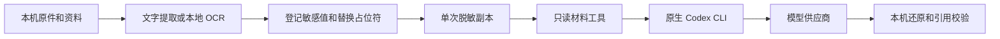

# 隐私保护

所有生产 AI 功能经过同一脱敏网关。原始资料留在本机，模型获得脱敏文字和布局信息；结果还原后继续核验字段、模板引文和源码证据。当前实现保留 Windows 原生 Codex CLI，不需要 WSL、Docker、Windows Sandbox 或 GPU。

## 数据流



| 入口 | 模型可见内容 | 本机保留 |
| --- | --- | --- |
| 项目分析和会话 | 脱敏经历、资料、最近 16 条消息和有界源码副本 | 原始源码目录、数据库、旧供应商会话 |
| 模板识别和修复 | 脱敏节点文字、字段需求、位置和校验反馈 | DOCX/PDF/图片原件、照片、试填资料 |
| 荣誉识别 | 本地提取并脱敏的证书文字和坐标 | 原始证书及页面像素 |
| 保存、预览和导出 | 不调用模型 | 使用真实资料本机处理 |

## Windows 工具沙箱

这里的 sandbox 是**受限工具和脱敏副本组成的应用层边界**，没有宣称为 AppContainer 或虚拟机。受信任的应用后端和 CLI 控制进程仍以当前 Windows 账户运行。模型不能任意运行 PowerShell，也没有本机通用文件读取入口。

- 每轮在系统盘 `ResumeMakerSandbox/task-*` 建立独立目录。父目录及任务文件 ACL 只允许当前账户、管理员和 SYSTEM；任务结束清理。脱敏材料和控制文件分开保存。
- CLI 使用新的 `CODEX_HOME`、`--ephemeral`、`--ignore-user-config`、`--ignore-rules` 和严格配置，不续用供应商会话。仅复制 `auth.json`；不复制旧历史、技能、插件和项目规则。
- 禁用 shell、补丁、浏览器、计算机操作、图片、搜索、代理、记忆和外部 MCP。只注册内置 `resume_materials` 服务，提供 `read_material` 和 `search_materials`。CLI 仍保留自身的 MCP 资源调度和交互工具，但本服务不提供资源、写入、网络或执行接口。
- 材料工具仅接受 `context.txt` 和 `source-0001.txt` 这类生成编号。绝对路径、`..`、Windows ADS、链接、硬链接和未登记文件名被拒绝；原文件名只作为脱敏后的引用元数据。读取最多 200 行，搜索最多 100 条结果，输出有界。
- 目前固定验证 Codex CLI **0.154.0**。其他版本停止调用，需要先重新验证工具集合再升级支持范围；工具服务启动失败也不会切换到普通 shell。
- Windows Job Object 回收 CLI 和全部后代；取消和超时不发布迟到结果。不能撤回供应商已经收到的数据。

这能约束模型通过已注册工具访问资料，不能防御已被篡改的 CLI、本机恶意程序或操作系统漏洞。此前测试中 CLI 原生 Windows 沙箱对部分公共读取目录未能阻断，因此本实现不以它作为原件隔离保证。

## 脱敏规则

每轮登记本实例的个人信息、教育院校、荣誉获奖人、颁发单位、证书编号和补充敏感词，模板任务同时登记尚未保存的当前资料。隐藏字段同样处理。

规则识别常见邮箱、电话、身份证号、长卡号、网址、IP、用户目录，以及明确标注的姓名和地址。已知值同时处理 JSON Unicode 转义和 URL 编码。同轮相同值共用随机占位符，跨轮重新生成；映射只在内存保存，跨行替换保留换行。凭据和私钥直接移除，不可还原。编码附件及过长编码文本拒绝发送。未知或损坏的返回占位符拒绝采用。

源码本地收集最多 200 个文件，单文件 128000 字节，正文合计 350000 字符，目录和文件名分别最多检查 10000 个；跳过链接、凭据、二进制、常见数据和依赖目录。遗漏范围明确提供给模型。引用还原后继续对照原文件核验。

## 本地 OCR 和开销

使用 **RapidOCR 1.4.4 + PP-OCRv4 移动版 ONNX + ONNX Runtime CPU**，模型随 Python 依赖安装，识别时不联网下载。模型延迟加载、单份复用、串行推理，设置 2 个计算线程和 1 个算子间线程。

1. 可靠 PDF 文字层直接提取。扫描页和含较大图像的混合页本地 OCR，文字层和 OCR 按位置去重。
2. 默认检测输入长边 960 像素。结果稀疏、字号过小或置信度低于 0.85 时，最多以长边 2000 像素复核一次；不放大低分辨率原图。
3. 较高分辨率结果只在覆盖不减少、平均置信度没有明显下降时采用。置信度是复核触发信号，不能代表真实准确率。证书出口的低分片段整体遮盖后外发，结果需对照原件确认。
4. 单文件最多 20 MB、12 页、单图 4000 万像素、10 万文字和 6000 个文字块。取消在页面和推理前后检查；正在执行的单次 ONNX 推理会完成后再响应取消。

图片和扫描模板可以恢复可编辑文字及大致位置，照片、印章、字体、装饰和复杂版式需人工补充。原生 Word/PDF 的本地资源保留不等于把原图交给模型。旋转 90 度、手写、艺术字和严重模糊照片仍可能识别失败，必要时先旋转、重新扫描或手工录入。基准及复现命令见 [OCR 评测](ocr-benchmark.md)。

## 登录和连接

复用 `CODEX_HOME/config.toml`、`profiles.<name>` 或 `<name>.config.toml` 中的模型、推理强度、供应商地址和鉴权字段。供应商使用 Responses 协议；远程地址要求 HTTPS，本机测试可使用 HTTP。自定义系统提示、工具、插件、HTTP 头及任意命令不会随配置继承。

API 环境变量或 `experimental_bearer_token` 只供 CLI 鉴权，不写入材料和审计。支持文件保存的 CLI 订阅登录；仅存在系统 keyring 中的登录不在本次兼容范围，请使用文件凭据登录。临时副本刷新令牌后，仅在原凭据未被其他 CLI 修改时保存新状态；应用内部串行复用登录，避免并发刷新。

CLI 负责最终 HTTP 协议、重试及供应商通信，应用不承诺第三方留存政策。每次从本机历史重新脱敏构建上下文，旧 `provider_thread_id` 不外发。

## 检查和限制

设置中的“隐私保护”可补充准确敏感值、在本机检测文字、查看和清除最近 10 份脱敏材料包。记录是交给 CLI 的材料和输出契约，**不是 CLI 最终 HTTP 请求的完整抓包**。`prepared` 只表示已准备，失败和取消也不能证明供应商未收到请求。

审计不包含鉴权、模型回复或还原表，但可能保留业务材料及规则遗漏的内容；它随本机数据库和 ZIP 备份保存，没有新增静态加密。

自动规则和 OCR 无法识别全部未知姓名、无标签身份、任意编码、商业秘密或间接身份线索。OCR 高置信度也可能漏字、误认；沙箱只能限制读取范围，不能修复脱敏漏检。需补充学校、单位、地点等敏感词并核对识别结果，不能承诺完全匿名或零泄露。旧版本已发送的数据无法撤回。

## 验证

普通测试使用合成资料和 CLI 替身；本地 OCR 测试实际运行 CPU 模型。额外验收用真实 Windows CLI 连接本机假 Responses 服务，验证工具清单、用户规则不进入上下文、shell 调用不可用、脱敏读取成功、路径穿越被拒绝、凭据不进入模型正文和取消回收。没有在这些验收中向真实供应商发送资料。

```powershell
$env:RESUME_MAKER_TEST_NATIVE_CLI = '1'
uv run pytest tests/test_privacy_sandbox.py -q
```
